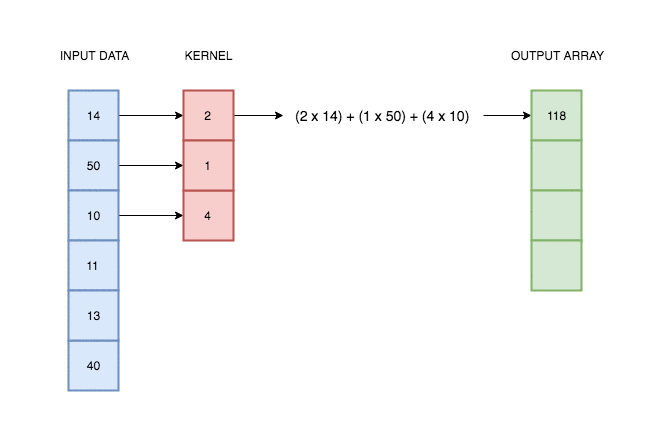

```python
## Download dataset
!wget https://raw.githubusercontent.com/jbrownlee/Datasets/master/shampoo.csv
```

    --2019-12-14 13:03:31--  https://raw.githubusercontent.com/jbrownlee/Datasets/master/shampoo.csv
    Resolving raw.githubusercontent.com (raw.githubusercontent.com)... 199.232.16.133
    Connecting to raw.githubusercontent.com (raw.githubusercontent.com)|199.232.16.133|:443... connected.
    HTTP request sent, awaiting response... 200 OK
    Length: 519 [text/plain]
    Saving to: ‘shampoo.csv’
    
    shampoo.csv         100%[===================>]     519  --.-KB/s    in 0s      
    
    2019-12-14 13:03:32 (33,6 MB/s) - ‘shampoo.csv’ saved [519/519]
    


```python
import numpy as np
import pandas as pd
import matplotlib.pyplot as plt
```


```python
data = pd.read_csv("shampoo.csv")
plt.plot(data['Sales'])
```


    [<matplotlib.lines.Line2D at 0x7ff6ebe62b38>]


```python
import torch.optim as optim
import torch.nn as nn
import torch.nn.functional as F
import torch
```

## 1. Apply moving average


Source: https://blog.floydhub.com/reading-minds-with-deep-learning/


```python
ts = data.Sales
ts_tensor = torch.Tensor(ts).reshape(1, 1, -1)
```


```python
kernel = [0.5, 0.5]
kernel_tensor = torch.Tensor(kernel).reshape(1, 1, -1)
```


```python
F.conv1d(ts_tensor, kernel_tensor)
```


    tensor([[[205.9500, 164.5000, 151.2000, 149.8000, 174.4000, 200.1500, 228.1500,
              208.6500, 157.8500, 229.7000, 261.2000, 190.1000, 171.9000, 179.8000,
              241.7000, 232.3500, 239.2000, 256.5000, 264.8000, 296.7500, 355.7500,
              343.0500, 303.4000, 341.0000, 390.0500, 378.1500, 377.6000, 420.3000,
              419.3500, 506.4500, 491.5500, 544.8000, 578.6500, 528.3000, 614.1000]]])


```python
ts.rolling(2).mean()
```


    0        NaN
    1     205.95
    2     164.50
    3     151.20
    4     149.80
    5     174.40
    6     200.15
    7     228.15
    8     208.65
    9     157.85
    10    229.70
    11    261.20
    12    190.10
    13    171.90
    14    179.80
    15    241.70
    16    232.35
    17    239.20
    18    256.50
    19    264.80
    20    296.75
    21    355.75
    22    343.05
    23    303.40
    24    341.00
    25    390.05
    26    378.15
    27    377.60
    28    420.30
    29    419.35
    30    506.45
    31    491.55
    32    544.80
    33    578.65
    34    528.30
    35    614.10
    Name: Sales, dtype: float64


## 2. Learning a network, which computes moving average


```python
X = data.Sales
X_tensor = torch.Tensor(X).reshape(1,1,-1)

y = data.Sales.rolling(5).mean()
y = y[4:, ].to_numpy()
y_tensor = torch.Tensor(y).reshape(1,1,-1)
y_tensor
```


    tensor([[[178.9200, 159.4200, 176.6000, 184.8800, 199.5800, 188.1000, 221.7000,
              212.5200, 206.4800, 197.8200, 215.2600, 202.6200, 203.7200, 222.2600,
              237.5600, 256.2600, 259.5800, 305.6200, 301.1200, 324.3800, 331.6000,
              361.7000, 340.5600, 375.5200, 387.3200, 406.8600, 433.8800, 452.2200,
              500.7600, 515.5600, 544.3400, 558.6200]]])


```python
# Building a network
net = nn.Conv1d(1, 1, 5, padding_mode="valid")
```


```python
# Initial values
net.weight.data.numpy()
```


    array([[[ 0.25895965, -0.00114489,  0.01369303, -0.27942085,
              0.12607741]]], dtype=float32)


```python
net(X_tensor)
```


    tensor([[[ 60.6557,  10.1060,  31.9255,  -3.4353,  11.2847,   8.1014,  70.5294,
              -10.9534,  26.9823,  -1.4211,  74.3385,  25.7513,   0.8225,  24.9547,
                5.0505,  49.6478,   4.0840,  50.4054, -22.2741,  53.3461,  25.4297,
               74.2023, -10.4392,  61.4355,  19.6707,  62.7496,  37.1717,   9.9087,
               83.4283, -12.4137,  98.4187,  30.4470]]],
           grad_fn=<SqueezeBackward1>)


```python
# Training a network
loss = nn.MSELoss()
optimizer = optim.Adam(net.parameters(), lr=0.01)
```


```python
# Here, he have only one example so it does not make sense to divide training into epochs
```


```python
running_loss = 0.0
for iteration in range(1000):
    optimizer.zero_grad()
    
    outputs = net(X_tensor)  
    # print(outputs)
    
    loss_value = torch.mean((outputs - y_tensor)**2)
    loss_value.backward()
    optimizer.step()
    
    running_loss += loss_value.item()
    
    print('[%d] loss: %.3f' % (iteration, loss_value.item()))
    
    print(net.weight.data.numpy())
    
```

    [0] loss: 263.358
    [[[0.3652763  0.24271394 0.1460073  0.01332371 0.2523629 ]]]
    [1] loss: 258.985
    [[[0.3644006  0.24322207 0.14557678 0.01450832 0.25173065]]]
    [2] loss: 254.656
    [[[0.36351252 0.24370828 0.14513707 0.01567283 0.25108588]]]
    [3] loss: 250.388
    [[[0.36261728 0.24417758 0.1446934  0.01682212 0.25043383]]]
    [4] loss: 246.198
    [[[0.36172035 0.24463522 0.14425123 0.01796133 0.24977997]]]
    [5] loss: 242.098
    [[[0.36082706 0.24508633 0.14381586 0.01909542 0.24912961]]]
    [6] loss: 238.093
    [[[0.35994226 0.24553554 0.14339213 0.02022892 0.24848758]]]
    [7] loss: 234.180
    [[[0.35907    0.24598674 0.14298409 0.02136561 0.24785794]]]
    [8] loss: 230.353
    [[[0.35821337 0.24644288 0.14259478 0.02250832 0.24724378]]]
    [9] loss: 226.599
    [[[0.3573743  0.24690579 0.14222616 0.02365881 0.24664702]]]
    [10] loss: 222.908
    [[[0.3565536  0.24737617 0.14187898 0.02481774 0.24606846]]]
    [11] loss: 219.271
    [[[0.35575098 0.24785367 0.14155291 0.02598471 0.24550779]]]
    [12] loss: 215.687
    [[[0.35496506 0.24833693 0.14124662 0.02715836 0.24496368]]]
    [13] loss: 212.153
    [[[0.35419375 0.2488238  0.14095792 0.02833656 0.24443398]]]
    [14] loss: 208.675
    [[[0.3534343  0.2493116  0.14068407 0.02951659 0.24391598]]]
    [15] loss: 205.257
    [[[0.3526836  0.24979722 0.14042194 0.03069542 0.24340655]]]
    [16] loss: 201.904
    [[[0.3519385  0.25027755 0.14016832 0.0318699  0.24290252]]]
    [17] loss: 198.619
    [[[0.3511959  0.25074953 0.13992013 0.03303704 0.24240081]]]
    [18] loss: 195.402
    [[[0.35045314 0.2512105  0.13967462 0.03419419 0.24189873]]]
    [19] loss: 192.251
    [[[0.34970802 0.25165832 0.13942957 0.03533917 0.24139409]]]
    [20] loss: 189.162
    [[[0.34895897 0.2520914  0.1391834  0.03647044 0.24088532]]]
    [21] loss: 186.132
    [[[0.34820512 0.2525089  0.13893522 0.03758712 0.24037156]]]
    [22] loss: 183.155
    [[[0.34744632 0.25291064 0.13868484 0.03868899 0.23985265]]]
    [23] loss: 180.231
    [[[0.34668308 0.2532971  0.13843273 0.0397765  0.23932908]]]
    [24] loss: 177.356
    [[[0.34591645 0.25366926 0.13817993 0.0408506  0.23880193]]]
    [25] loss: 174.533
    [[[0.3451479  0.25402862 0.1379279  0.0419127  0.23827267]]]
    [26] loss: 171.760
    [[[0.34437928 0.25437692 0.13767843 0.04296447 0.23774311]]]
    [27] loss: 169.041
    [[[0.34361246 0.25471604 0.13743341 0.04400773 0.23721518]]]
    [28] loss: 166.374
    [[[0.3428494  0.25504783 0.13719472 0.04504427 0.23669079]]]
    [29] loss: 163.761
    [[[0.3420918  0.255374   0.13696408 0.04607574 0.23617168]]]
    [30] loss: 161.200
    [[[0.34134114 0.25569603 0.13674293 0.04710351 0.2356593 ]]]
    [31] loss: 158.690
    [[[0.34059852 0.25601494 0.13653234 0.0481286  0.23515476]]]
    [32] loss: 156.228
    [[[0.3398646  0.2563314  0.13633294 0.04915165 0.23465875]]]
    [33] loss: 153.813
    [[[0.33913967 0.2566457  0.13614497 0.05017287 0.2341715 ]]]
    [34] loss: 151.443
    [[[0.3384235  0.25695768 0.13596821 0.05119209 0.23369284]]]
    [35] loss: 149.117
    [[[0.33771557 0.25726682 0.13580209 0.05220876 0.23322223]]]
    [36] loss: 146.835
    [[[0.33701503 0.25757235 0.13564575 0.05322209 0.23275885]]]
    [37] loss: 144.596
    [[[0.33632088 0.25787327 0.1354981  0.05423108 0.23230165]]]
    [38] loss: 142.400
    [[[0.33563194 0.2581685  0.135358   0.05523464 0.2318495 ]]]
    [39] loss: 140.247
    [[[0.33494708 0.25845695 0.13522427 0.05623166 0.23140126]]]
    [40] loss: 138.137
    [[[0.33426526 0.2587376  0.13509579 0.05722112 0.23095587]]]
    [41] loss: 136.068
    [[[0.33358556 0.25900963 0.13497165 0.05820218 0.23051243]]]
    [42] loss: 134.039
    [[[0.3329073  0.2592724  0.13485113 0.0591742  0.23007025]]]
    [43] loss: 132.050
    [[[0.33223003 0.25952554 0.13473377 0.06013677 0.22962892]]]
    [44] loss: 130.100
    [[[0.33155364 0.25976893 0.13461939 0.06108975 0.2291883 ]]]
    [45] loss: 128.187
    [[[0.3308782  0.26000273 0.13450804 0.06203325 0.22874847]]]
    [46] loss: 126.310
    [[[0.33020404 0.26022726 0.13440003 0.06296759 0.22830977]]]
    [47] loss: 124.469
    [[[0.32953167 0.2604431  0.1342958  0.06389328 0.22787268]]]
    [48] loss: 122.664
    [[[0.32886168 0.26065084 0.13419598 0.06481092 0.22743785]]]
    [49] loss: 120.893
    [[[0.32819477 0.26085126 0.1341012  0.06572121 0.22700596]]]
    [50] loss: 119.156
    [[[0.32753164 0.26104507 0.1340121  0.0666248  0.22657768]]]
    [51] loss: 117.454
    [[[0.3268729  0.2612329  0.13392928 0.06752232 0.22615366]]]
    [52] loss: 115.784
    [[[0.32621902 0.26141533 0.13385323 0.0684143  0.2257344 ]]]
    [53] loss: 114.147
    [[[0.32557043 0.26159278 0.13378428 0.06930112 0.22532028]]]
    [54] loss: 112.540
    [[[0.32492733 0.2617655  0.13372262 0.07018302 0.22491153]]]
    [55] loss: 110.965
    [[[0.32428974 0.26193365 0.13366826 0.07106008 0.2245082 ]]]
    [56] loss: 109.420
    [[[0.3236576  0.26209715 0.13362108 0.07193224 0.22411019]]]
    [57] loss: 107.903
    [[[0.32303065 0.26225582 0.13358079 0.0727993  0.22371726]]]
    [58] loss: 106.416
    [[[0.32240853 0.2624094  0.13354702 0.07366097 0.22332907]]]
    [59] loss: 104.957
    [[[0.32179084 0.26255754 0.13351932 0.07451689 0.22294521]]]
    [60] loss: 103.525
    [[[0.32117715 0.2626999  0.13349722 0.07536669 0.22256526]]]
    [61] loss: 102.120
    [[[0.320567   0.26283613 0.13348025 0.07620999 0.22218879]]]
    [62] loss: 100.742
    [[[0.31996006 0.26296592 0.133468   0.07704648 0.2218154 ]]]
    [63] loss: 99.390
    [[[0.31935596 0.26308903 0.13346013 0.07787589 0.22144482]]]
    [64] loss: 98.062
    [[[0.31875452 0.26320532 0.1334564  0.07869808 0.2210768 ]]]
    [65] loss: 96.760
    [[[0.31815562 0.26331475 0.13345663 0.07951296 0.22071126]]]
    [66] loss: 95.482
    [[[0.3175592  0.26341736 0.13346079 0.08032058 0.22034816]]]
    [67] loss: 94.227
    [[[0.3169654  0.26351333 0.13346891 0.08112106 0.2199876 ]]]
    [68] loss: 92.995
    [[[0.31637433 0.26360285 0.13348112 0.08191458 0.21962972]]]
    [69] loss: 91.786
    [[[0.3157862  0.2636862  0.13349757 0.08270139 0.21927473]]]
    [70] loss: 90.599
    [[[0.31520125 0.2637637  0.13351847 0.08348177 0.21892287]]]
    [71] loss: 89.433
    [[[0.31461972 0.2638356  0.13354404 0.08425601 0.21857437]]]
    [72] loss: 88.289
    [[[0.3140418  0.26390228 0.13357446 0.08502435 0.21822949]]]
    [73] loss: 87.165
    [[[0.31346768 0.2639639  0.13360986 0.08578704 0.21788837]]]
    [74] loss: 86.061
    [[[0.3128975  0.26402074 0.13365035 0.08654424 0.21755117]]]
    [75] loss: 84.977
    [[[0.31233132 0.26407292 0.13369596 0.08729608 0.21721795]]]
    [76] loss: 83.912
    [[[0.31176913 0.26412052 0.13374667 0.08804262 0.21688873]]]
    [77] loss: 82.866
    [[[0.3112109  0.26416355 0.13380237 0.08878387 0.21656343]]]
    [78] loss: 81.838
    [[[0.3106565  0.264202   0.13386294 0.08951977 0.21624197]]]
    [79] loss: 80.828
    [[[0.31010577 0.2642358  0.13392818 0.09025024 0.21592419]]]
    [80] loss: 79.836
    [[[0.30955857 0.26426485 0.13399789 0.09097517 0.21560992]]]
    [81] loss: 78.860
    [[[0.30901468 0.26428908 0.13407186 0.09169446 0.215299  ]]]
    [82] loss: 77.901
    [[[0.30847394 0.2643084  0.13414988 0.09240799 0.21499124]]]
    [83] loss: 76.959
    [[[0.30793622 0.2643227  0.13423176 0.09311569 0.21468651]]]
    [84] loss: 76.032
    [[[0.30740136 0.26433197 0.13431735 0.09381748 0.21438468]]]
    [85] loss: 75.121
    [[[0.3068693  0.2643362  0.13440654 0.09451336 0.21408565]]]
    [86] loss: 74.225
    [[[0.30633995 0.26433545 0.13449922 0.09520333 0.2137894 ]]]
    [87] loss: 73.344
    [[[0.30581334 0.26432976 0.13459536 0.09588744 0.21349591]]]
    [88] loss: 72.478
    [[[0.30528948 0.26431924 0.13469496 0.0965658  0.2132052 ]]]
    [89] loss: 71.625
    [[[0.3047684  0.26430404 0.13479804 0.0972385  0.21291734]]]
    [90] loss: 70.787
    [[[0.3042502  0.2642843  0.13490462 0.09790567 0.21263239]]]
    [91] loss: 69.962
    [[[0.30373493 0.26426017 0.13501476 0.09856746 0.21235043]]]
    [92] loss: 69.150
    [[[0.30322266 0.2642318  0.13512848 0.09922398 0.21207154]]]
    [93] loss: 68.351
    [[[0.30271345 0.26419935 0.13524583 0.09987537 0.21179578]]]
    [94] loss: 67.564
    [[[0.30220735 0.26416293 0.13536681 0.10052173 0.21152319]]]
    [95] loss: 66.790
    [[[0.30170438 0.26412264 0.13549142 0.10116313 0.21125379]]]
    [96] loss: 66.028
    [[[0.30120453 0.26407856 0.13561961 0.10179965 0.21098758]]]
    [97] loss: 65.277
    [[[0.30070776 0.26403072 0.13575132 0.10243131 0.21072453]]]
    [98] loss: 64.538
    [[[0.30021402 0.2639792  0.13588648 0.10305813 0.2104646 ]]]
    [99] loss: 63.810
    [[[0.29972324 0.26392397 0.13602497 0.1036801  0.21020772]]]
    [100] loss: 63.093
    [[[0.29923534 0.26386505 0.13616668 0.10429722 0.2099538 ]]]
    [101] loss: 62.387
    [[[0.29875025 0.26380244 0.1363115  0.10490946 0.20970277]]]
    [102] loss: 61.691
    [[[0.29826787 0.26373613 0.13645934 0.10551682 0.20945455]]]
    [103] loss: 61.006
    [[[0.2977881  0.26366612 0.13661006 0.10611928 0.20920905]]]
    [104] loss: 60.330
    [[[0.29731092 0.26359245 0.13676359 0.10671684 0.20896623]]]
    [105] loss: 59.664
    [[[0.29683626 0.26351514 0.13691983 0.10730954 0.20872602]]]
    [106] loss: 59.008
    [[[0.29636407 0.26343423 0.13707873 0.10789739 0.2084884 ]]]
    [107] loss: 58.361
    [[[0.29589435 0.2633498  0.13724026 0.10848045 0.20825337]]]
    [108] loss: 57.723
    [[[0.2954271  0.2632619  0.13740437 0.10905877 0.20802091]]]
    [109] loss: 57.094
    [[[0.29496235 0.26317066 0.13757104 0.10963243 0.20779103]]]
    [110] loss: 56.473
    [[[0.29450005 0.26307613 0.13774024 0.11020151 0.20756374]]]
    [111] loss: 55.861
    [[[0.29404023 0.2629784  0.13791198 0.11076608 0.20733908]]]
    [112] loss: 55.258
    [[[0.29358295 0.26287758 0.13808623 0.11132621 0.20711704]]]
    [113] loss: 54.662
    [[[0.29312816 0.26277375 0.13826297 0.11188198 0.20689763]]]
    [114] loss: 54.075
    [[[0.29267588 0.262667   0.13844219 0.11243345 0.20668086]]]
    [115] loss: 53.495
    [[[0.2922261  0.2625574  0.13862385 0.11298068 0.20646673]]]
    [116] loss: 52.923
    [[[0.29177883 0.26244497 0.1388079  0.11352371 0.20625521]]]
    [117] loss: 52.358
    [[[0.291334   0.2623298  0.13899426 0.11406257 0.20604628]]]
    [118] loss: 51.801
    [[[0.2908916  0.2622119  0.13918291 0.1145973  0.2058399 ]]]
    [119] loss: 51.251
    [[[0.29045156 0.2620913  0.13937375 0.11512791 0.20563602]]]
    [120] loss: 50.707
    [[[0.29001388 0.26196808 0.13956672 0.11565443 0.20543462]]]
    [121] loss: 50.171
    [[[0.28957847 0.26184222 0.13976176 0.11617687 0.20523563]]]
    [122] loss: 49.641
    [[[0.2891453  0.26171377 0.13995878 0.11669524 0.20503902]]]
    [123] loss: 49.118
    [[[0.28871432 0.26158276 0.14015773 0.11720958 0.20484476]]]
    [124] loss: 48.602
    [[[0.28828552 0.26144922 0.14035854 0.1177199  0.20465279]]]
    [125] loss: 48.091
    [[[0.28785887 0.2613132  0.14056115 0.11822624 0.2044631 ]]]
    [126] loss: 47.587
    [[[0.28743434 0.26117474 0.14076553 0.11872864 0.20427565]]]
    [127] loss: 47.089
    [[[0.2870119  0.2610339  0.14097163 0.11922714 0.20409046]]]
    [128] loss: 46.597
    [[[0.28659153 0.26089072 0.14117943 0.11972179 0.20390749]]]
    [129] loss: 46.111
    [[[0.28617325 0.26074532 0.14138888 0.12021264 0.20372674]]]
    [130] loss: 45.630
    [[[0.28575706 0.2605977  0.14159995 0.12069975 0.20354821]]]
    [131] loss: 45.155
    [[[0.28534293 0.26044798 0.14181264 0.12118316 0.20337188]]]
    [132] loss: 44.686
    [[[0.28493086 0.26029617 0.14202689 0.12166293 0.20319776]]]
    [133] loss: 44.221
    [[[0.28452083 0.26014233 0.14224267 0.1221391  0.20302583]]]
    [134] loss: 43.763
    [[[0.28411287 0.25998655 0.14245996 0.12261172 0.2028561 ]]]
    [135] loss: 43.309
    [[[0.2837069  0.25982884 0.1426787  0.12308083 0.20268852]]]
    [136] loss: 42.861
    [[[0.28330293 0.25966927 0.14289886 0.12354645 0.20252308]]]
    [137] loss: 42.417
    [[[0.28290096 0.25950786 0.14312038 0.12400863 0.20235977]]]
    [138] loss: 41.979
    [[[0.28250092 0.25934467 0.14334323 0.12446738 0.20219854]]]
    [139] loss: 41.545
    [[[0.28210282 0.2591797  0.14356734 0.12492274 0.20203936]]]
    [140] loss: 41.116
    [[[0.2817066  0.25901303 0.14379267 0.12537473 0.20188221]]]
    [141] loss: 40.692
    [[[0.28131226 0.25884464 0.14401919 0.1258234  0.20172708]]]
    [142] loss: 40.272
    [[[0.28091973 0.25867462 0.14424683 0.12626873 0.20157391]]]
    [143] loss: 39.857
    [[[0.28052902 0.258503   0.14447555 0.12671079 0.20142269]]]
    [144] loss: 39.446
    [[[0.28014013 0.25832978 0.14470531 0.12714958 0.2012734 ]]]
    [145] loss: 39.040
    [[[0.279753   0.25815502 0.14493608 0.12758516 0.20112602]]]
    [146] loss: 38.638
    [[[0.27936763 0.25797877 0.14516783 0.12801756 0.20098054]]]
    [147] loss: 38.240
    [[[0.278984   0.25780106 0.1454005  0.12844682 0.20083694]]]
    [148] loss: 37.846
    [[[0.27860212 0.25762194 0.14563407 0.12887296 0.2006952 ]]]
    [149] loss: 37.457
    [[[0.27822196 0.2574415  0.14586852 0.12929603 0.20055532]]]
    [150] loss: 37.071
    [[[0.27784353 0.25725973 0.14610381 0.12971608 0.20041728]]]
    [151] loss: 36.690
    [[[0.2774668  0.25707668 0.14633992 0.13013314 0.20028107]]]
    [152] loss: 36.312
    [[[0.27709177 0.2568924  0.14657682 0.13054723 0.20014666]]]
    [153] loss: 35.938
    [[[0.2767184  0.25670695 0.14681447 0.13095838 0.20001405]]]
    [154] loss: 35.568
    [[[0.2763467  0.25652033 0.14705282 0.13136664 0.19988324]]]
    [155] loss: 35.202
    [[[0.27597666 0.25633258 0.14729187 0.13177204 0.19975418]]]
    [156] loss: 34.840
    [[[0.27560824 0.25614375 0.14753155 0.1321746  0.19962686]]]
    [157] loss: 34.481
    [[[0.27524143 0.25595388 0.14777185 0.13257435 0.19950126]]]
    [158] loss: 34.125
    [[[0.27487624 0.25576296 0.14801273 0.13297132 0.19937737]]]
    [159] loss: 33.774
    [[[0.27451262 0.25557107 0.14825414 0.13336553 0.19925515]]]
    [160] loss: 33.425
    [[[0.27415055 0.25537822 0.14849606 0.133757   0.1991346 ]]]
    [161] loss: 33.081
    [[[0.27379003 0.25518444 0.14873846 0.13414575 0.19901569]]]
    [162] loss: 32.739
    [[[0.27343103 0.25498977 0.14898129 0.13453184 0.1988984 ]]]
    [163] loss: 32.401
    [[[0.27307352 0.25479424 0.14922453 0.13491526 0.19878271]]]
    [164] loss: 32.066
    [[[0.27271754 0.25459787 0.14946815 0.13529606 0.19866861]]]
    [165] loss: 31.735
    [[[0.27236304 0.2544007  0.14971213 0.13567427 0.19855608]]]
    [166] loss: 31.407
    [[[0.27201    0.25420275 0.14995643 0.13604991 0.19844511]]]
    [167] loss: 31.082
    [[[0.27165842 0.2540041  0.15020104 0.136423   0.19833569]]]
    [168] loss: 30.760
    [[[0.2713083  0.2538047  0.15044591 0.1367936  0.19822781]]]
    [169] loss: 30.441
    [[[0.27095962 0.25360468 0.15069103 0.13716172 0.19812144]]]
    [170] loss: 30.125
    [[[0.2706124  0.25340402 0.15093638 0.13752738 0.19801658]]]
    [171] loss: 29.813
    [[[0.27026656 0.25320274 0.15118192 0.1378906  0.19791321]]]
    [172] loss: 29.503
    [[[0.26992217 0.2530009  0.15142764 0.13825144 0.19781132]]]
    [173] loss: 29.196
    [[[0.26957914 0.25279847 0.15167351 0.13860989 0.19771087]]]
    [174] loss: 28.892
    [[[0.26923752 0.25259554 0.1519195  0.13896598 0.19761187]]]
    [175] loss: 28.592
    [[[0.26889727 0.2523921  0.15216558 0.13931975 0.1975143 ]]]
    [176] loss: 28.294
    [[[0.26855838 0.2521882  0.15241171 0.1396712  0.19741814]]]
    [177] loss: 27.998
    [[[0.26822084 0.25198385 0.1526579  0.14002039 0.19732338]]]
    [178] loss: 27.706
    [[[0.26788464 0.25177908 0.15290411 0.1403673  0.19723001]]]
    [179] loss: 27.417
    [[[0.26754978 0.25157392 0.1531503  0.14071198 0.197138  ]]]
    [180] loss: 27.130
    [[[0.26721624 0.2513684  0.15339647 0.14105444 0.19704734]]]
    [181] loss: 26.846
    [[[0.266884   0.25116253 0.15364258 0.1413947  0.196958  ]]]
    [182] loss: 26.564
    [[[0.26655304 0.25095633 0.15388861 0.1417328  0.19687   ]]]
    [183] loss: 26.285
    [[[0.26622337 0.25074983 0.15413456 0.14206873 0.1967833 ]]]
    [184] loss: 26.009
    [[[0.26589498 0.25054306 0.15438038 0.14240253 0.1966979 ]]]
    [185] loss: 25.736
    [[[0.26556787 0.25033602 0.15462606 0.14273423 0.19661379]]]
    [186] loss: 25.465
    [[[0.265242   0.25012875 0.15487157 0.14306384 0.19653094]]]
    [187] loss: 25.197
    [[[0.2649174  0.24992128 0.1551169  0.14339139 0.19644934]]]
    [188] loss: 24.931
    [[[0.26459405 0.24971363 0.15536204 0.14371689 0.19636899]]]
    [189] loss: 24.668
    [[[0.26427191 0.24950582 0.15560697 0.14404036 0.19628987]]]
    [190] loss: 24.407
    [[[0.26395103 0.24929787 0.15585166 0.14436184 0.19621196]]]
    [191] loss: 24.148
    [[[0.26363137 0.2490898  0.1560961  0.14468133 0.19613527]]]
    [192] loss: 23.892
    [[[0.2633129  0.24888164 0.15634026 0.14499886 0.19605976]]]
    [193] loss: 23.639
    [[[0.26299566 0.2486734  0.15658413 0.14531446 0.19598545]]]
    [194] loss: 23.388
    [[[0.2626796  0.24846509 0.15682769 0.14562812 0.1959123 ]]]
    [195] loss: 23.139
    [[[0.26236475 0.24825674 0.15707092 0.14593989 0.1958403 ]]]
    [196] loss: 22.893
    [[[0.26205105 0.24804838 0.15731381 0.14624976 0.19576944]]]
    [197] loss: 22.649
    [[[0.26173854 0.24784    0.15755633 0.14655775 0.19569972]]]
    [198] loss: 22.407
    [[[0.2614272  0.24763164 0.15779847 0.1468639  0.19563112]]]
    [199] loss: 22.167
    [[[0.261117   0.2474233  0.15804021 0.14716819 0.19556361]]]
    [200] loss: 21.930
    [[[0.26080796 0.24721502 0.15828153 0.14747067 0.1954972 ]]]
    [201] loss: 21.695
    [[[0.26050007 0.2470068  0.15852244 0.14777134 0.19543187]]]
    [202] loss: 21.462
    [[[0.26019332 0.24679866 0.1587629  0.14807023 0.19536762]]]
    [203] loss: 21.232
    [[[0.2598877  0.24659063 0.1590029  0.14836735 0.19530442]]]
    [204] loss: 21.004
    [[[0.2595832  0.24638271 0.15924244 0.14866272 0.19524227]]]
    [205] loss: 20.777
    [[[0.25927982 0.24617492 0.15948148 0.14895634 0.19518116]]]
    [206] loss: 20.553
    [[[0.25897756 0.24596727 0.15972003 0.14924826 0.19512108]]]
    [207] loss: 20.331
    [[[0.2586764  0.24575979 0.15995806 0.14953847 0.19506203]]]
    [208] loss: 20.112
    [[[0.25837636 0.24555248 0.16019557 0.149827   0.19500397]]]
    [209] loss: 19.894
    [[[0.2580774  0.24534537 0.16043255 0.15011385 0.19494691]]]
    [210] loss: 19.678
    [[[0.25777957 0.24513847 0.16066897 0.15039904 0.19489084]]]
    [211] loss: 19.465
    [[[0.2574828  0.24493179 0.16090482 0.1506826  0.19483575]]]
    [212] loss: 19.253
    [[[0.2571871  0.24472533 0.1611401  0.15096451 0.19478162]]]
    [213] loss: 19.044
    [[[0.25689247 0.24451913 0.16137479 0.15124482 0.19472843]]]
    [214] loss: 18.836
    [[[0.25659892 0.24431318 0.16160887 0.15152352 0.19467619]]]
    [215] loss: 18.631
    [[[0.25630644 0.24410751 0.16184235 0.15180063 0.19462489]]]
    [216] loss: 18.427
    [[[0.25601503 0.24390213 0.16207519 0.15207617 0.1945745 ]]]
    [217] loss: 18.225
    [[[0.25572467 0.24369705 0.16230741 0.15235016 0.19452503]]]
    [218] loss: 18.026
    [[[0.25543538 0.24349226 0.16253899 0.1526226  0.19447647]]]
    [219] loss: 17.828
    [[[0.25514713 0.2432878  0.16276991 0.1528935  0.1944288 ]]]
    [220] loss: 17.632
    [[[0.25485992 0.24308367 0.16300017 0.15316288 0.19438201]]]
    [221] loss: 17.438
    [[[0.25457376 0.24287988 0.16322975 0.15343075 0.1943361 ]]]
    [222] loss: 17.246
    [[[0.25428864 0.24267644 0.16345865 0.15369712 0.19429106]]]
    [223] loss: 17.056
    [[[0.25400454 0.24247336 0.16368684 0.153962   0.19424686]]]
    [224] loss: 16.867
    [[[0.25372148 0.24227066 0.16391434 0.15422541 0.19420351]]]
    [225] loss: 16.681
    [[[0.25343943 0.24206834 0.16414112 0.15448737 0.194161  ]]]
    [226] loss: 16.496
    [[[0.2531584  0.24186641 0.16436718 0.15474789 0.19411932]]]
    [227] loss: 16.313
    [[[0.2528784  0.24166489 0.16459252 0.15500696 0.19407846]]]
    [228] loss: 16.132
    [[[0.25259942 0.24146378 0.16481712 0.15526462 0.19403842]]]
    [229] loss: 15.953
    [[[0.25232145 0.24126309 0.16504098 0.15552086 0.19399919]]]
    [230] loss: 15.775
    [[[0.25204447 0.24106283 0.16526408 0.1557757  0.19396074]]]
    [231] loss: 15.599
    [[[0.2517685  0.24086303 0.16548644 0.15602915 0.19392309]]]
    [232] loss: 15.425
    [[[0.25149354 0.24066366 0.16570802 0.15628122 0.19388622]]]
    [233] loss: 15.253
    [[[0.25121957 0.24046476 0.16592883 0.15653192 0.19385011]]]
    [234] loss: 15.082
    [[[0.2509466  0.24026632 0.16614886 0.15678126 0.19381477]]]
    [235] loss: 14.913
    [[[0.25067464 0.24006835 0.1663681  0.15702926 0.19378018]]]
    [236] loss: 14.745
    [[[0.25040364 0.23987086 0.16658655 0.15727592 0.19374634]]]
    [237] loss: 14.580
    [[[0.25013363 0.23967385 0.1668042  0.15752123 0.19371323]]]
    [238] loss: 14.415
    [[[0.24986462 0.23947734 0.16702104 0.15776524 0.19368085]]]
    [239] loss: 14.253
    [[[0.2495966  0.23928133 0.16723707 0.15800793 0.1936492 ]]]
    [240] loss: 14.092
    [[[0.24932954 0.23908582 0.16745229 0.15824933 0.19361825]]]
    [241] loss: 13.933
    [[[0.24906346 0.23889083 0.16766667 0.15848944 0.19358802]]]
    [242] loss: 13.775
    [[[0.24879836 0.23869635 0.16788024 0.15872826 0.19355848]]]
    [243] loss: 13.619
    [[[0.24853422 0.2385024  0.16809297 0.1589658  0.19352964]]]
    [244] loss: 13.464
    [[[0.24827105 0.23830898 0.16830486 0.15920208 0.19350147]]]
    [245] loss: 13.311
    [[[0.24800885 0.2381161  0.1685159  0.15943712 0.19347398]]]
    [246] loss: 13.160
    [[[0.24774761 0.23792377 0.1687261  0.1596709  0.19344716]]]
    [247] loss: 13.010
    [[[0.24748735 0.23773198 0.16893545 0.15990345 0.193421  ]]]
    [248] loss: 12.861
    [[[0.24722804 0.23754075 0.16914394 0.16013478 0.19339551]]]
    [249] loss: 12.715
    [[[0.2469697  0.23735008 0.1693516  0.16036488 0.19337066]]]
    [250] loss: 12.569
    [[[0.24671231 0.23715998 0.16955838 0.16059378 0.19334644]]]
    [251] loss: 12.425
    [[[0.24645588 0.23697045 0.1697643  0.16082147 0.19332287]]]
    [252] loss: 12.282
    [[[0.2462004  0.2367815  0.16996934 0.16104797 0.19329992]]]
    [253] loss: 12.141
    [[[0.24594587 0.23659311 0.17017351 0.16127327 0.1932776 ]]]
    [254] loss: 12.002
    [[[0.2456923  0.23640531 0.17037681 0.1614974  0.19325589]]]
    [255] loss: 11.863
    [[[0.24543966 0.2362181  0.17057921 0.16172035 0.19323477]]]
    [256] loss: 11.727
    [[[0.24518797 0.23603147 0.17078073 0.16194214 0.19321425]]]
    [257] loss: 11.591
    [[[0.24493723 0.23584545 0.17098138 0.16216277 0.19319433]]]
    [258] loss: 11.457
    [[[0.24468742 0.23566002 0.17118113 0.16238225 0.193175  ]]]
    [259] loss: 11.324
    [[[0.24443856 0.23547518 0.17137998 0.16260059 0.19315626]]]
    [260] loss: 11.193
    [[[0.24419063 0.23529096 0.17157795 0.16281779 0.19313808]]]
    [261] loss: 11.063
    [[[0.24394365 0.23510735 0.17177501 0.16303387 0.19312046]]]
    [262] loss: 10.935
    [[[0.2436976  0.23492435 0.17197119 0.16324884 0.19310342]]]
    [263] loss: 10.807
    [[[0.24345249 0.23474196 0.17216647 0.16346268 0.19308694]]]
    [264] loss: 10.681
    [[[0.24320832 0.23456019 0.17236085 0.16367543 0.19307101]]]
    [265] loss: 10.557
    [[[0.24296507 0.23437905 0.17255433 0.16388707 0.19305561]]]
    [266] loss: 10.433
    [[[0.24272276 0.23419854 0.1727469  0.16409762 0.19304076]]]
    [267] loss: 10.311
    [[[0.24248138 0.23401865 0.17293856 0.16430709 0.19302644]]]
    [268] loss: 10.190
    [[[0.24224092 0.2338394  0.1731293  0.16451547 0.19301264]]]
    [269] loss: 10.071
    [[[0.24200138 0.23366076 0.17331915 0.16472277 0.19299936]]]
    [270] loss: 9.952
    [[[0.24176277 0.23348275 0.17350808 0.164929   0.1929866 ]]]
    [271] loss: 9.835
    [[[0.24152508 0.23330538 0.1736961  0.16513416 0.19297433]]]
    [272] loss: 9.719
    [[[0.24128832 0.23312864 0.1738832  0.16533826 0.19296257]]]
    [273] loss: 9.605
    [[[0.24105248 0.23295254 0.17406939 0.16554132 0.1929513 ]]]
    [274] loss: 9.491
    [[[0.24081756 0.23277709 0.17425467 0.16574334 0.19294053]]]
    [275] loss: 9.379
    [[[0.24058357 0.23260228 0.17443904 0.16594432 0.19293025]]]
    [276] loss: 9.268
    [[[0.24035048 0.23242812 0.1746225  0.16614427 0.19292046]]]
    [277] loss: 9.158
    [[[0.24011832 0.23225461 0.17480505 0.1663432  0.19291115]]]
    [278] loss: 9.049
    [[[0.23988707 0.23208174 0.17498668 0.1665411  0.1929023 ]]]
    [279] loss: 8.942
    [[[0.23965675 0.23190953 0.17516738 0.16673799 0.1928939 ]]]
    [280] loss: 8.835
    [[[0.23942733 0.23173796 0.17534718 0.16693386 0.19288598]]]
    [281] loss: 8.730
    [[[0.23919882 0.23156704 0.17552605 0.16712874 0.19287851]]]
    [282] loss: 8.626
    [[[0.23897122 0.23139678 0.17570402 0.16732262 0.1928715 ]]]
    [283] loss: 8.523
    [[[0.23874453 0.23122716 0.17588106 0.1675155  0.19286491]]]
    [284] loss: 8.421
    [[[0.23851874 0.2310582  0.17605719 0.16770738 0.19285877]]]
    [285] loss: 8.320
    [[[0.23829387 0.23088989 0.1762324  0.16789828 0.19285306]]]
    [286] loss: 8.220
    [[[0.2380699  0.23072223 0.1764067  0.16808821 0.19284779]]]
    [287] loss: 8.122
    [[[0.23784684 0.23055524 0.17658009 0.16827716 0.19284293]]]
    [288] loss: 8.024
    [[[0.23762468 0.2303889  0.17675255 0.16846514 0.19283849]]]
    [289] loss: 7.927
    [[[0.23740342 0.23022321 0.17692411 0.16865216 0.19283447]]]
    [290] loss: 7.832
    [[[0.23718306 0.2300582  0.17709476 0.16883823 0.19283086]]]
    [291] loss: 7.737
    [[[0.23696361 0.22989383 0.1772645  0.16902335 0.19282766]]]
    [292] loss: 7.644
    [[[0.23674507 0.22973013 0.17743333 0.16920751 0.19282486]]]
    [293] loss: 7.551
    [[[0.23652743 0.2295671  0.17760125 0.16939074 0.19282246]]]
    [294] loss: 7.460
    [[[0.23631068 0.22940472 0.17776826 0.16957302 0.19282044]]]
    [295] loss: 7.369
    [[[0.23609482 0.229243   0.17793436 0.16975437 0.19281882]]]
    [296] loss: 7.280
    [[[0.23587985 0.22908193 0.17809956 0.1699348  0.19281757]]]
    [297] loss: 7.191
    [[[0.23566578 0.22892152 0.17826384 0.1701143  0.1928167 ]]]
    [298] loss: 7.104
    [[[0.2354526  0.22876176 0.17842722 0.17029287 0.1928162 ]]]
    [299] loss: 7.017
    [[[0.23524033 0.22860266 0.1785897  0.17047052 0.19281606]]]
    [300] loss: 6.931
    [[[0.23502892 0.22844423 0.17875127 0.17064726 0.1928163 ]]]
    [301] loss: 6.847
    [[[0.23481841 0.22828646 0.17891195 0.1708231  0.1928169 ]]]
    [302] loss: 6.763
    [[[0.2346088  0.22812934 0.17907172 0.17099804 0.19281785]]]
    [303] loss: 6.680
    [[[0.23440008 0.22797288 0.1792306  0.17117207 0.19281915]]]
    [304] loss: 6.598
    [[[0.23419224 0.22781707 0.17938858 0.1713452  0.19282079]]]
    [305] loss: 6.517
    [[[0.23398529 0.22766194 0.17954567 0.17151746 0.19282278]]]
    [306] loss: 6.437
    [[[0.23377922 0.22750746 0.17970186 0.17168884 0.19282511]]]
    [307] loss: 6.358
    [[[0.23357405 0.22735363 0.17985718 0.17185932 0.19282778]]]
    [308] loss: 6.279
    [[[0.23336975 0.22720046 0.1800116  0.17202894 0.19283077]]]
    [309] loss: 6.202
    [[[0.23316634 0.22704795 0.18016514 0.17219768 0.1928341 ]]]
    [310] loss: 6.125
    [[[0.2329638  0.22689608 0.18031779 0.17236556 0.19283774]]]
    [311] loss: 6.049
    [[[0.23276214 0.22674486 0.18046956 0.17253257 0.19284171]]]
    [312] loss: 5.974
    [[[0.23256136 0.2265943  0.18062043 0.17269872 0.19284599]]]
    [313] loss: 5.900
    [[[0.23236145 0.2264444  0.18077043 0.172864   0.19285057]]]
    [314] loss: 5.827
    [[[0.23216242 0.22629513 0.18091954 0.17302844 0.19285546]]]
    [315] loss: 5.755
    [[[0.23196426 0.22614652 0.1810678  0.17319202 0.19286065]]]
    [316] loss: 5.683
    [[[0.23176697 0.22599855 0.18121517 0.17335476 0.19286613]]]
    [317] loss: 5.612
    [[[0.23157056 0.22585124 0.18136168 0.17351666 0.19287191]]]
    [318] loss: 5.542
    [[[0.23137501 0.22570457 0.18150732 0.17367773 0.192878  ]]]
    [319] loss: 5.473
    [[[0.23118034 0.22555855 0.1816521  0.17383796 0.19288436]]]
    [320] loss: 5.405
    [[[0.23098654 0.22541317 0.18179601 0.17399736 0.192891  ]]]
    [321] loss: 5.337
    [[[0.2307936  0.22526845 0.18193907 0.17415594 0.19289793]]]
    [322] loss: 5.270
    [[[0.23060153 0.22512437 0.18208125 0.1743137  0.19290514]]]
    [323] loss: 5.204
    [[[0.23041034 0.22498094 0.18222259 0.17447063 0.19291262]]]
    [324] loss: 5.139
    [[[0.23022    0.22483814 0.18236308 0.17462675 0.19292037]]]
    [325] loss: 5.074
    [[[0.23003052 0.22469598 0.1825027  0.17478205 0.19292839]]]
    [326] loss: 5.010
    [[[0.2298419  0.22455446 0.18264148 0.17493655 0.19293667]]]
    [327] loss: 4.947
    [[[0.22965415 0.22441357 0.1827794  0.17509024 0.19294521]]]
    [328] loss: 4.884
    [[[0.22946724 0.22427332 0.18291649 0.17524312 0.192954  ]]]
    [329] loss: 4.823
    [[[0.2292812  0.2241337  0.18305273 0.17539522 0.19296305]]]
    [330] loss: 4.762
    [[[0.22909601 0.22399472 0.18318814 0.17554651 0.19297233]]]
    [331] loss: 4.701
    [[[0.22891167 0.22385636 0.18332271 0.17569701 0.19298187]]]
    [332] loss: 4.642
    [[[0.22872818 0.22371863 0.18345645 0.17584674 0.19299164]]]
    [333] loss: 4.583
    [[[0.22854555 0.22358154 0.18358935 0.17599568 0.19300166]]]
    [334] loss: 4.525
    [[[0.22836377 0.22344507 0.18372142 0.17614384 0.19301191]]]
    [335] loss: 4.467
    [[[0.22818284 0.22330923 0.18385267 0.17629123 0.1930224 ]]]
    [336] loss: 4.410
    [[[0.22800276 0.22317402 0.1839831  0.17643784 0.19303311]]]
    [337] loss: 4.354
    [[[0.22782351 0.22303943 0.18411271 0.17658368 0.19304405]]]
    [338] loss: 4.298
    [[[0.22764511 0.22290546 0.1842415  0.17672876 0.19305521]]]
    [339] loss: 4.243
    [[[0.22746757 0.2227721  0.18436949 0.17687307 0.1930666 ]]]
    [340] loss: 4.189
    [[[0.22729085 0.22263938 0.18449666 0.17701663 0.19307819]]]
    [341] loss: 4.135
    [[[0.22711498 0.22250727 0.18462302 0.17715943 0.19309   ]]]
    [342] loss: 4.082
    [[[0.22693993 0.22237577 0.18474858 0.17730148 0.19310203]]]
    [343] loss: 4.030
    [[[0.22676572 0.22224487 0.18487333 0.17744277 0.19311425]]]
    [344] loss: 3.978
    [[[0.22659235 0.2221146  0.18499728 0.17758332 0.19312668]]]
    [345] loss: 3.927
    [[[0.2264198  0.22198492 0.18512043 0.17772312 0.1931393 ]]]
    [346] loss: 3.876
    [[[0.2262481  0.22185586 0.18524279 0.17786218 0.19315213]]]
    [347] loss: 3.826
    [[[0.22607723 0.22172742 0.18536435 0.17800051 0.19316515]]]
    [348] loss: 3.777
    [[[0.22590719 0.22159958 0.18548512 0.1781381  0.19317837]]]
    [349] loss: 3.728
    [[[0.22573797 0.22147234 0.18560512 0.17827497 0.19319177]]]
    [350] loss: 3.680
    [[[0.22556958 0.22134571 0.18572433 0.17841111 0.19320536]]]
    [351] loss: 3.632
    [[[0.22540201 0.22121967 0.18584277 0.17854652 0.19321913]]]
    [352] loss: 3.585
    [[[0.22523527 0.22109424 0.18596043 0.17868121 0.19323307]]]
    [353] loss: 3.538
    [[[0.22506934 0.2209694  0.18607731 0.17881519 0.1932472 ]]]
    [354] loss: 3.492
    [[[0.22490424 0.22084515 0.18619344 0.17894845 0.1932615 ]]]
    [355] loss: 3.447
    [[[0.22473995 0.2207215  0.18630879 0.179081   0.19327597]]]
    [356] loss: 3.402
    [[[0.22457647 0.22059844 0.18642338 0.17921284 0.19329062]]]
    [357] loss: 3.358
    [[[0.22441381 0.22047597 0.1865372  0.17934397 0.19330543]]]
    [358] loss: 3.314
    [[[0.22425196 0.2203541  0.18665028 0.1794744  0.19332041]]]
    [359] loss: 3.271
    [[[0.22409092 0.2202328  0.18676259 0.17960413 0.19333555]]]
    [360] loss: 3.228
    [[[0.22393069 0.22011209 0.18687415 0.17973316 0.19335084]]]
    [361] loss: 3.185
    [[[0.22377126 0.21999197 0.18698497 0.1798615  0.19336629]]]
    [362] loss: 3.144
    [[[0.22361264 0.21987242 0.18709505 0.17998914 0.19338189]]]
    [363] loss: 3.102
    [[[0.22345482 0.21975344 0.18720438 0.1801161  0.19339764]]]
    [364] loss: 3.062
    [[[0.22329779 0.21963505 0.18731296 0.18024237 0.19341354]]]
    [365] loss: 3.021
    [[[0.22314157 0.21951725 0.18742082 0.18036798 0.19342959]]]
    [366] loss: 2.982
    [[[0.22298615 0.2194     0.18752794 0.1804929  0.19344577]]]
    [367] loss: 2.942
    [[[0.22283152 0.21928334 0.18763433 0.18061714 0.1934621 ]]]
    [368] loss: 2.903
    [[[0.22267768 0.21916725 0.18774001 0.18074071 0.19347857]]]
    [369] loss: 2.865
    [[[0.22252463 0.21905172 0.18784496 0.18086362 0.19349517]]]
    [370] loss: 2.827
    [[[0.22237237 0.21893676 0.1879492  0.18098585 0.1935119 ]]]
    [371] loss: 2.790
    [[[0.2222209  0.21882236 0.18805271 0.18110743 0.19352877]]]
    [372] loss: 2.753
    [[[0.22207022 0.21870853 0.18815552 0.18122834 0.19354577]]]
    [373] loss: 2.716
    [[[0.22192031 0.21859527 0.1882576  0.18134859 0.1935629 ]]]
    [374] loss: 2.680
    [[[0.22177118 0.21848255 0.18835899 0.18146819 0.19358014]]]
    [375] loss: 2.645
    [[[0.22162284 0.2183704  0.18845966 0.18158713 0.1935975 ]]]
    [376] loss: 2.609
    [[[0.22147527 0.2182588  0.18855965 0.18170542 0.19361497]]]
    [377] loss: 2.575
    [[[0.22132848 0.21814775 0.18865894 0.18182306 0.19363257]]]
    [378] loss: 2.540
    [[[0.22118247 0.21803726 0.18875752 0.18194006 0.19365029]]]
    [379] loss: 2.506
    [[[0.22103722 0.21792732 0.18885542 0.18205643 0.19366811]]]
    [380] loss: 2.473
    [[[0.22089274 0.21781792 0.18895264 0.18217215 0.19368605]]]
    [381] loss: 2.440
    [[[0.22074904 0.21770906 0.18904917 0.18228723 0.1937041 ]]]
    [382] loss: 2.407
    [[[0.22060609 0.21760075 0.18914501 0.18240169 0.19372225]]]
    [383] loss: 2.375
    [[[0.2204639  0.21749298 0.18924019 0.1825155  0.1937405 ]]]
    [384] loss: 2.343
    [[[0.22032247 0.21738575 0.18933469 0.18262869 0.19375886]]]
    [385] loss: 2.311
    [[[0.22018181 0.21727906 0.18942852 0.18274125 0.19377731]]]
    [386] loss: 2.280
    [[[0.2200419  0.21717292 0.18952169 0.1828532  0.19379586]]]
    [387] loss: 2.250
    [[[0.21990275 0.21706732 0.18961419 0.18296453 0.19381452]]]
    [388] loss: 2.219
    [[[0.21976435 0.21696223 0.18970603 0.18307525 0.19383326]]]
    [389] loss: 2.189
    [[[0.21962671 0.21685769 0.18979721 0.18318535 0.1938521 ]]]
    [390] loss: 2.160
    [[[0.21948981 0.21675366 0.18988773 0.18329485 0.19387102]]]
    [391] loss: 2.131
    [[[0.21935366 0.21665017 0.1899776  0.18340373 0.19389002]]]
    [392] loss: 2.102
    [[[0.21921825 0.2165472  0.19006683 0.183512   0.19390911]]]
    [393] loss: 2.073
    [[[0.21908358 0.21644476 0.19015542 0.18361968 0.19392829]]]
    [394] loss: 2.045
    [[[0.21894965 0.21634284 0.19024335 0.18372674 0.19394754]]]
    [395] loss: 2.017
    [[[0.21881644 0.21624143 0.19033065 0.18383321 0.19396687]]]
    [396] loss: 1.990
    [[[0.21868397 0.21614054 0.19041732 0.18393908 0.19398627]]]
    [397] loss: 1.963
    [[[0.21855225 0.21604016 0.19050336 0.18404436 0.19400574]]]
    [398] loss: 1.936
    [[[0.21842125 0.2159403  0.19058876 0.18414906 0.1940253 ]]]
    [399] loss: 1.910
    [[[0.21829098 0.21584095 0.19067355 0.18425316 0.19404492]]]
    [400] loss: 1.884
    [[[0.21816143 0.21574211 0.1907577  0.18435667 0.19406462]]]
    [401] loss: 1.858
    [[[0.21803261 0.21564378 0.19084124 0.18445961 0.19408438]]]
    [402] loss: 1.833
    [[[0.21790451 0.21554595 0.19092417 0.18456198 0.19410421]]]
    [403] loss: 1.807
    [[[0.21777713 0.21544863 0.19100648 0.18466377 0.1941241 ]]]
    [404] loss: 1.783
    [[[0.21765047 0.21535182 0.1910882  0.184765   0.19414407]]]
    [405] loss: 1.758
    [[[0.21752453 0.21525551 0.1911693  0.18486564 0.1941641 ]]]
    [406] loss: 1.734
    [[[0.2173993  0.2151597  0.1912498  0.18496571 0.19418418]]]
    [407] loss: 1.710
    [[[0.21727477 0.21506438 0.1913297  0.18506522 0.19420432]]]
    [408] loss: 1.687
    [[[0.21715094 0.21496955 0.191409   0.18516417 0.1942245 ]]]
    [409] loss: 1.664
    [[[0.21702781 0.2148752  0.19148771 0.18526255 0.19424474]]]
    [410] loss: 1.641
    [[[0.21690539 0.21478136 0.19156583 0.18536036 0.19426504]]]
    [411] loss: 1.618
    [[[0.21678366 0.214688   0.19164336 0.18545762 0.19428538]]]
    [412] loss: 1.596
    [[[0.21666263 0.21459514 0.1917203  0.18555433 0.19430576]]]
    [413] loss: 1.574
    [[[0.2165423  0.21450275 0.19179668 0.18565048 0.19432619]]]
    [414] loss: 1.552
    [[[0.21642268 0.21441086 0.19187246 0.18574609 0.19434667]]]
    [415] loss: 1.530
    [[[0.21630374 0.21431944 0.19194768 0.18584116 0.19436719]]]
    [416] loss: 1.509
    [[[0.21618548 0.21422851 0.19202232 0.18593568 0.19438775]]]
    [417] loss: 1.488
    [[[0.21606791 0.21413806 0.1920964  0.18602966 0.19440836]]]
    [418] loss: 1.468
    [[[0.21595103 0.21404809 0.19216992 0.1861231  0.19442901]]]
    [419] loss: 1.447
    [[[0.21583483 0.21395858 0.19224288 0.18621601 0.1944497 ]]]
    [420] loss: 1.427
    [[[0.2157193  0.21386954 0.19231527 0.18630838 0.19447042]]]
    [421] loss: 1.407
    [[[0.21560445 0.21378098 0.1923871  0.18640022 0.19449118]]]
    [422] loss: 1.388
    [[[0.21549028 0.21369289 0.19245839 0.18649153 0.19451196]]]
    [423] loss: 1.368
    [[[0.21537678 0.21360525 0.19252913 0.18658231 0.19453278]]]
    [424] loss: 1.349
    [[[0.21526395 0.21351808 0.19259931 0.18667257 0.19455363]]]
    [425] loss: 1.330
    [[[0.21515177 0.21343139 0.19266896 0.1867623  0.1945745 ]]]
    [426] loss: 1.312
    [[[0.21504027 0.21334516 0.19273807 0.18685152 0.19459541]]]
    [427] loss: 1.293
    [[[0.21492942 0.21325937 0.19280665 0.18694022 0.19461635]]]
    [428] loss: 1.275
    [[[0.21481922 0.21317405 0.19287468 0.18702841 0.1946373 ]]]
    [429] loss: 1.257
    [[[0.21470968 0.21308918 0.19294219 0.18711609 0.19465828]]]
    [430] loss: 1.240
    [[[0.2146008  0.21300477 0.19300917 0.18720326 0.19467928]]]
    [431] loss: 1.222
    [[[0.21449257 0.2129208  0.19307563 0.18728992 0.1947003 ]]]
    [432] loss: 1.205
    [[[0.214385   0.2128373  0.19314156 0.18737608 0.19472134]]]
    [433] loss: 1.188
    [[[0.21427807 0.21275423 0.19320698 0.18746173 0.1947424 ]]]
    [434] loss: 1.171
    [[[0.21417178 0.21267162 0.19327188 0.18754688 0.19476347]]]
    [435] loss: 1.155
    [[[0.21406613 0.21258944 0.19333626 0.18763153 0.19478455]]]
    [436] loss: 1.138
    [[[0.21396112 0.21250771 0.19340014 0.18771568 0.19480565]]]
    [437] loss: 1.122
    [[[0.21385674 0.21242642 0.19346352 0.18779933 0.19482675]]]
    [438] loss: 1.106
    [[[0.213753   0.21234557 0.19352639 0.1878825  0.19484787]]]
    [439] loss: 1.091
    [[[0.21364988 0.21226516 0.19358876 0.18796518 0.194869  ]]]
    [440] loss: 1.075
    [[[0.21354741 0.21218519 0.19365063 0.18804738 0.19489014]]]
    [441] loss: 1.060
    [[[0.21344556 0.21210565 0.19371201 0.1881291  0.19491129]]]
    [442] loss: 1.045
    [[[0.21334434 0.21202654 0.19377291 0.18821032 0.19493245]]]
    [443] loss: 1.030
    [[[0.21324374 0.21194786 0.19383332 0.18829107 0.1949536 ]]]
    [444] loss: 1.015
    [[[0.21314375 0.21186961 0.19389324 0.18837135 0.19497477]]]
    [445] loss: 1.001
    [[[0.21304439 0.2117918  0.19395268 0.18845116 0.19499594]]]
    [446] loss: 0.987
    [[[0.21294564 0.2117144  0.19401164 0.18853049 0.19501711]]]
    [447] loss: 0.973
    [[[0.21284749 0.21163742 0.19407013 0.18860935 0.19503827]]]
    [448] loss: 0.959
    [[[0.21274994 0.21156086 0.19412814 0.18868773 0.19505943]]]
    [449] loss: 0.945
    [[[0.21265301 0.21148473 0.19418567 0.18876565 0.1950806 ]]]
    [450] loss: 0.931
    [[[0.21255668 0.21140902 0.19424273 0.1888431  0.19510175]]]
    [451] loss: 0.918
    [[[0.21246094 0.2113337  0.19429933 0.1889201  0.1951229 ]]]
    [452] loss: 0.905
    [[[0.2123658  0.21125881 0.19435546 0.18899663 0.19514404]]]
    [453] loss: 0.892
    [[[0.21227127 0.21118434 0.19441114 0.18907271 0.19516519]]]
    [454] loss: 0.879
    [[[0.21217734 0.21111028 0.19446637 0.18914834 0.19518632]]]
    [455] loss: 0.867
    [[[0.21208398 0.21103662 0.19452114 0.18922351 0.19520745]]]
    [456] loss: 0.854
    [[[0.21199122 0.21096338 0.19457547 0.18929824 0.19522856]]]
    [457] loss: 0.842
    [[[0.21189904 0.21089055 0.19462936 0.18937252 0.19524968]]]
    [458] loss: 0.830
    [[[0.21180744 0.21081811 0.19468279 0.18944636 0.19527078]]]
    [459] loss: 0.818
    [[[0.21171643 0.21074608 0.19473578 0.18951975 0.19529186]]]
    [460] loss: 0.806
    [[[0.211626   0.21067445 0.19478834 0.18959269 0.19531293]]]
    [461] loss: 0.794
    [[[0.21153612 0.21060322 0.19484045 0.1896652  0.19533399]]]
    [462] loss: 0.783
    [[[0.21144684 0.21053238 0.19489212 0.18973726 0.19535503]]]
    [463] loss: 0.771
    [[[0.21135812 0.21046194 0.19494337 0.18980889 0.19537605]]]
    [464] loss: 0.760
    [[[0.21126996 0.2103919  0.19499418 0.18988009 0.19539706]]]
    [465] loss: 0.749
    [[[0.21118237 0.21032223 0.19504458 0.18995085 0.19541804]]]
    [466] loss: 0.738
    [[[0.21109535 0.21025297 0.19509454 0.19002119 0.19543901]]]
    [467] loss: 0.728
    [[[0.21100888 0.2101841  0.19514409 0.1900911  0.19545996]]]
    [468] loss: 0.717
    [[[0.21092297 0.21011561 0.19519322 0.19016059 0.1954809 ]]]
    [469] loss: 0.707
    [[[0.21083762 0.21004751 0.19524193 0.19022965 0.1955018 ]]]
    [470] loss: 0.696
    [[[0.21075282 0.2099798  0.19529024 0.1902983  0.1955227 ]]]
    [471] loss: 0.686
    [[[0.21066856 0.20991246 0.19533813 0.19036654 0.19554356]]]
    [472] loss: 0.676
    [[[0.21058486 0.20984551 0.19538562 0.19043435 0.1955644 ]]]
    [473] loss: 0.666
    [[[0.2105017  0.20977893 0.19543271 0.19050175 0.19558522]]]
    [474] loss: 0.657
    [[[0.21041909 0.20971273 0.1954794  0.19056873 0.19560601]]]
    [475] loss: 0.647
    [[[0.21033701 0.20964691 0.19552568 0.19063531 0.19562677]]]
    [476] loss: 0.637
    [[[0.21025547 0.20958146 0.19557157 0.19070147 0.19564751]]]
    [477] loss: 0.628
    [[[0.21017447 0.20951639 0.19561706 0.19076723 0.19566822]]]
    [478] loss: 0.619
    [[[0.21009399 0.20945168 0.19566217 0.19083259 0.1956889 ]]]
    [479] loss: 0.610
    [[[0.21001405 0.20938733 0.19570689 0.19089754 0.19570956]]]
    [480] loss: 0.601
    [[[0.20993462 0.20932336 0.19575122 0.19096209 0.19573018]]]
    [481] loss: 0.592
    [[[0.20985574 0.20925975 0.19579518 0.19102624 0.19575077]]]
    [482] loss: 0.583
    [[[0.20977736 0.20919651 0.19583875 0.19109    0.19577132]]]
    [483] loss: 0.575
    [[[0.2096995  0.20913363 0.19588195 0.19115336 0.19579184]]]
    [484] loss: 0.566
    [[[0.20962216 0.2090711  0.19592477 0.19121633 0.19581233]]]
    [485] loss: 0.558
    [[[0.20954534 0.20900895 0.19596723 0.19127892 0.19583279]]]
    [486] loss: 0.550
    [[[0.20946904 0.20894714 0.19600931 0.19134112 0.1958532 ]]]
    [487] loss: 0.542
    [[[0.20939323 0.20888568 0.19605102 0.19140293 0.19587359]]]
    [488] loss: 0.534
    [[[0.20931794 0.20882459 0.19609237 0.19146435 0.19589394]]]
    [489] loss: 0.526
    [[[0.20924315 0.20876385 0.19613335 0.1915254  0.19591425]]]
    [490] loss: 0.518
    [[[0.20916887 0.20870346 0.19617397 0.19158606 0.19593453]]]
    [491] loss: 0.510
    [[[0.20909508 0.20864342 0.19621423 0.19164635 0.19595477]]]
    [492] loss: 0.503
    [[[0.20902179 0.20858373 0.19625415 0.19170626 0.19597498]]]
    [493] loss: 0.495
    [[[0.208949   0.20852439 0.19629371 0.19176579 0.19599514]]]
    [494] loss: 0.488
    [[[0.2088767  0.2084654  0.19633292 0.19182494 0.19601525]]]
    [495] loss: 0.481
    [[[0.20880489 0.20840675 0.19637178 0.19188373 0.19603534]]]
    [496] loss: 0.473
    [[[0.20873356 0.20834844 0.1964103  0.19194216 0.19605538]]]
    [497] loss: 0.466
    [[[0.20866272 0.20829046 0.19644848 0.19200021 0.19607538]]]
    [498] loss: 0.459
    [[[0.20859236 0.20823282 0.19648631 0.1920579  0.19609533]]]
    [499] loss: 0.453
    [[[0.20852247 0.20817553 0.1965238  0.19211522 0.19611524]]]
    [500] loss: 0.446
    [[[0.20845306 0.20811856 0.19656096 0.19217218 0.1961351 ]]]
    [501] loss: 0.439
    [[[0.20838413 0.20806193 0.19659778 0.1922288  0.19615494]]]
    [502] loss: 0.433
    [[[0.20831567 0.20800564 0.19663428 0.19228505 0.19617473]]]
    [503] loss: 0.426
    [[[0.20824768 0.20794967 0.19667044 0.19234094 0.19619447]]]
    [504] loss: 0.420
    [[[0.20818016 0.20789403 0.19670628 0.19239648 0.19621417]]]
    [505] loss: 0.413
    [[[0.2081131  0.20783871 0.19674179 0.19245167 0.19623381]]]
    [506] loss: 0.407
    [[[0.20804651 0.20778373 0.19677699 0.1925065  0.1962534 ]]]
    [507] loss: 0.401
    [[[0.20798038 0.20772907 0.19681185 0.192561   0.19627295]]]
    [508] loss: 0.395
    [[[0.20791471 0.20767474 0.19684641 0.19261515 0.19629246]]]
    [509] loss: 0.389
    [[[0.20784949 0.20762073 0.19688065 0.19266894 0.19631192]]]
    [510] loss: 0.383
    [[[0.20778473 0.20756704 0.19691458 0.19272241 0.19633134]]]
    [511] loss: 0.377
    [[[0.20772041 0.20751366 0.19694822 0.19277553 0.19635071]]]
    [512] loss: 0.372
    [[[0.20765655 0.20746061 0.19698153 0.19282831 0.19637002]]]
    [513] loss: 0.366
    [[[0.20759313 0.20740788 0.19701454 0.19288075 0.19638929]]]
    [514] loss: 0.361
    [[[0.20753014 0.20735545 0.19704725 0.19293286 0.1964085 ]]]
    [515] loss: 0.355
    [[[0.2074676  0.20730335 0.19707966 0.19298463 0.19642766]]]
    [516] loss: 0.350
    [[[0.2074055  0.20725153 0.19711176 0.19303606 0.19644678]]]
    [517] loss: 0.345
    [[[0.20734383 0.20720004 0.19714357 0.19308718 0.19646583]]]
    [518] loss: 0.339
    [[[0.2072826  0.20714885 0.19717509 0.19313796 0.19648485]]]
    [519] loss: 0.334
    [[[0.20722179 0.20709798 0.1972063  0.19318841 0.1965038 ]]]
    [520] loss: 0.329
    [[[0.20716141 0.2070474  0.19723724 0.19323854 0.19652271]]]
    [521] loss: 0.324
    [[[0.20710146 0.20699713 0.19726788 0.19328834 0.19654156]]]
    [522] loss: 0.319
    [[[0.20704193 0.20694716 0.19729823 0.19333781 0.19656035]]]
    [523] loss: 0.314
    [[[0.20698284 0.2068975  0.1973283  0.19338697 0.1965791 ]]]
    [524] loss: 0.310
    [[[0.20692416 0.20684813 0.19735809 0.19343582 0.19659778]]]
    [525] loss: 0.305
    [[[0.20686589 0.20679906 0.1973876  0.19348435 0.19661643]]]
    [526] loss: 0.300
    [[[0.20680805 0.20675029 0.19741684 0.19353257 0.19663501]]]
    [527] loss: 0.296
    [[[0.20675062 0.20670182 0.19744581 0.19358048 0.19665354]]]
    [528] loss: 0.291
    [[[0.2066936  0.20665364 0.19747451 0.19362807 0.19667202]]]
    [529] loss: 0.287
    [[[0.206637   0.20660576 0.19750293 0.19367535 0.19669044]]]
    [530] loss: 0.282
    [[[0.20658079 0.20655817 0.19753107 0.19372232 0.19670881]]]
    [531] loss: 0.278
    [[[0.20652498 0.20651087 0.19755895 0.193769   0.19672713]]]
    [532] loss: 0.274
    [[[0.20646958 0.20646386 0.19758657 0.19381535 0.19674538]]]
    [533] loss: 0.270
    [[[0.20641457 0.20641713 0.19761391 0.19386141 0.19676358]]]
    [534] loss: 0.265
    [[[0.20635995 0.20637068 0.197641   0.19390716 0.19678171]]]
    [535] loss: 0.261
    [[[0.20630573 0.20632452 0.19766784 0.1939526  0.19679978]]]
    [536] loss: 0.257
    [[[0.2062519  0.20627864 0.1976944  0.19399776 0.1968178 ]]]
    [537] loss: 0.253
    [[[0.20619847 0.20623304 0.19772072 0.19404262 0.19683577]]]
    [538] loss: 0.249
    [[[0.20614542 0.20618773 0.1977468  0.19408719 0.19685368]]]
    [539] loss: 0.246
    [[[0.20609276 0.2061427  0.19777262 0.19413146 0.19687153]]]
    [540] loss: 0.242
    [[[0.20604049 0.20609795 0.19779819 0.19417545 0.19688933]]]
    [541] loss: 0.238
    [[[0.20598859 0.20605347 0.19782351 0.19421914 0.19690706]]]
    [542] loss: 0.234
    [[[0.20593707 0.20600925 0.19784859 0.19426255 0.19692473]]]
    [543] loss: 0.231
    [[[0.20588593 0.20596533 0.19787341 0.19430566 0.19694234]]]
    [544] loss: 0.227
    [[[0.20583516 0.20592166 0.197898   0.19434848 0.1969599 ]]]
    [545] loss: 0.224
    [[[0.20578477 0.20587827 0.19792235 0.19439103 0.19697739]]]
    [546] loss: 0.220
    [[[0.20573474 0.20583515 0.19794646 0.19443329 0.19699483]]]
    [547] loss: 0.217
    [[[0.20568508 0.2057923  0.19797033 0.19447526 0.1970122 ]]]
    [548] loss: 0.214
    [[[0.20563579 0.2057497  0.19799396 0.19451697 0.19702952]]]
    [549] loss: 0.210
    [[[0.20558685 0.20570739 0.19801737 0.1945584  0.19704677]]]
    [550] loss: 0.207
    [[[0.20553829 0.20566532 0.19804056 0.19459955 0.19706397]]]
    [551] loss: 0.204
    [[[0.20549008 0.20562352 0.19806351 0.19464043 0.1970811 ]]]
    [552] loss: 0.201
    [[[0.20544223 0.205582   0.19808623 0.19468103 0.19709818]]]
    [553] loss: 0.197
    [[[0.20539474 0.20554072 0.19810873 0.19472137 0.19711518]]]
    [554] loss: 0.194
    [[[0.2053476  0.2054997  0.19813101 0.19476144 0.19713213]]]
    [555] loss: 0.191
    [[[0.20530081 0.20545894 0.19815306 0.19480123 0.19714901]]]
    [556] loss: 0.188
    [[[0.20525436 0.20541844 0.1981749  0.19484076 0.19716583]]]
    [557] loss: 0.185
    [[[0.20520826 0.20537819 0.19819652 0.19488002 0.1971826 ]]]
    [558] loss: 0.183
    [[[0.20516251 0.2053382  0.19821793 0.19491902 0.1971993 ]]]
    [559] loss: 0.180
    [[[0.2051171  0.20529845 0.19823912 0.19495776 0.19721594]]]
    [560] loss: 0.177
    [[[0.20507203 0.20525897 0.1982601  0.19499624 0.19723251]]]
    [561] loss: 0.174
    [[[0.2050273  0.20521973 0.19828087 0.19503446 0.19724903]]]
    [562] loss: 0.171
    [[[0.2049829  0.20518073 0.19830143 0.19507241 0.19726548]]]
    [563] loss: 0.169
    [[[0.20493884 0.20514199 0.19832179 0.19511011 0.19728187]]]
    [564] loss: 0.166
    [[[0.20489511 0.20510349 0.19834194 0.19514756 0.19729818]]]
    [565] loss: 0.163
    [[[0.2048517  0.20506524 0.19836187 0.19518475 0.19731444]]]
    [566] loss: 0.161
    [[[0.20480862 0.20502722 0.19838162 0.19522169 0.19733064]]]
    [567] loss: 0.158
    [[[0.20476587 0.20498945 0.19840115 0.19525838 0.19734678]]]
    [568] loss: 0.156
    [[[0.20472345 0.20495193 0.1984205  0.19529481 0.19736286]]]
    [569] loss: 0.153
    [[[0.20468135 0.20491464 0.19843964 0.195331   0.19737886]]]
    [570] loss: 0.151
    [[[0.20463957 0.2048776  0.1984586  0.19536695 0.1973948 ]]]
    [571] loss: 0.149
    [[[0.2045981  0.2048408  0.19847736 0.19540265 0.19741069]]]
    [572] loss: 0.146
    [[[0.20455696 0.20480421 0.19849592 0.19543812 0.19742651]]]
    [573] loss: 0.144
    [[[0.20451613 0.20476787 0.1985143  0.19547333 0.19744226]]]
    [574] loss: 0.142
    [[[0.2044756  0.20473176 0.19853248 0.1955083  0.19745795]]]
    [575] loss: 0.140
    [[[0.20443538 0.20469588 0.19855048 0.19554304 0.19747359]]]
    [576] loss: 0.137
    [[[0.20439547 0.20466024 0.19856828 0.19557753 0.19748916]]]
    [577] loss: 0.135
    [[[0.20435588 0.20462482 0.19858591 0.19561179 0.19750465]]]
    [578] loss: 0.133
    [[[0.20431659 0.20458964 0.19860335 0.19564581 0.19752009]]]
    [579] loss: 0.131
    [[[0.20427759 0.20455468 0.1986206  0.1956796  0.19753547]]]
    [580] loss: 0.129
    [[[0.20423889 0.20451994 0.19863768 0.19571316 0.19755079]]]
    [581] loss: 0.127
    [[[0.20420049 0.20448543 0.19865458 0.19574648 0.19756603]]]
    [582] loss: 0.125
    [[[0.20416239 0.20445114 0.19867131 0.19577958 0.19758122]]]
    [583] loss: 0.123
    [[[0.20412458 0.20441708 0.19868787 0.19581245 0.19759634]]]
    [584] loss: 0.121
    [[[0.20408708 0.20438324 0.19870424 0.1958451  0.1976114 ]]]
    [585] loss: 0.119
    [[[0.20404986 0.20434962 0.19872046 0.19587752 0.1976264 ]]]
    [586] loss: 0.117
    [[[0.20401293 0.20431623 0.19873649 0.19590971 0.19764133]]]
    [587] loss: 0.115
    [[[0.20397629 0.20428304 0.19875236 0.19594167 0.1976562 ]]]
    [588] loss: 0.113
    [[[0.20393993 0.20425008 0.19876805 0.19597341 0.197671  ]]]
    [589] loss: 0.112
    [[[0.20390385 0.20421733 0.19878358 0.19600493 0.19768573]]]
    [590] loss: 0.110
    [[[0.20386806 0.2041848  0.19879894 0.19603623 0.1977004 ]]]
    [591] loss: 0.108
    [[[0.20383254 0.20415248 0.19881414 0.19606732 0.197715  ]]]
    [592] loss: 0.106
    [[[0.2037973  0.20412037 0.19882917 0.19609818 0.19772954]]]
    [593] loss: 0.105
    [[[0.20376234 0.20408846 0.19884405 0.19612883 0.19774403]]]
    [594] loss: 0.103
    [[[0.20372765 0.20405678 0.19885877 0.19615927 0.19775844]]]
    [595] loss: 0.101
    [[[0.20369324 0.20402531 0.19887333 0.19618951 0.19777279]]]
    [596] loss: 0.100
    [[[0.2036591  0.20399405 0.19888774 0.19621952 0.19778708]]]
    [597] loss: 0.098
    [[[0.20362523 0.203963   0.198902   0.19624932 0.1978013 ]]]
    [598] loss: 0.097
    [[[0.20359163 0.20393214 0.19891609 0.19627891 0.19781546]]]
    [599] loss: 0.095
    [[[0.20355828 0.20390148 0.19893004 0.1963083  0.19782956]]]
    [600] loss: 0.093
    [[[0.2035252  0.20387104 0.19894384 0.19633748 0.1978436 ]]]
    [601] loss: 0.092
    [[[0.20349237 0.20384079 0.19895749 0.19636644 0.19785756]]]
    [602] loss: 0.090
    [[[0.20345981 0.20381075 0.19897099 0.19639522 0.19787146]]]
    [603] loss: 0.089
    [[[0.20342751 0.2037809  0.19898434 0.19642378 0.19788529]]]
    [604] loss: 0.088
    [[[0.20339546 0.20375125 0.19899754 0.19645214 0.19789906]]]
    [605] loss: 0.086
    [[[0.20336367 0.2037218  0.1990106  0.1964803  0.19791277]]]
    [606] loss: 0.085
    [[[0.20333214 0.20369256 0.19902351 0.19650827 0.19792642]]]
    [607] loss: 0.083
    [[[0.20330085 0.2036635  0.19903629 0.19653603 0.19794   ]]]
    [608] loss: 0.082
    [[[0.20326981 0.20363463 0.19904892 0.1965636  0.19795352]]]
    [609] loss: 0.081
    [[[0.20323902 0.20360596 0.19906142 0.19659097 0.19796698]]]
    [610] loss: 0.079
    [[[0.20320849 0.20357749 0.19907379 0.19661815 0.19798037]]]
    [611] loss: 0.078
    [[[0.2031782  0.2035492  0.19908601 0.19664514 0.19799371]]]
    [612] loss: 0.077
    [[[0.20314814 0.20352112 0.1990981  0.19667193 0.19800699]]]
    [613] loss: 0.076
    [[[0.20311834 0.20349322 0.19911005 0.19669853 0.19802019]]]
    [614] loss: 0.074
    [[[0.20308878 0.2034655  0.19912186 0.19672495 0.19803333]]]
    [615] loss: 0.073
    [[[0.20305943 0.20343798 0.19913355 0.19675118 0.19804642]]]
    [616] loss: 0.072
    [[[0.20303033 0.20341064 0.1991451  0.19677721 0.19805942]]]
    [617] loss: 0.071
    [[[0.20300147 0.20338349 0.19915652 0.19680306 0.19807237]]]
    [618] loss: 0.070
    [[[0.20297284 0.20335652 0.19916782 0.19682872 0.19808526]]]
    [619] loss: 0.069
    [[[0.20294444 0.20332973 0.19917898 0.1968542  0.19809808]]]
    [620] loss: 0.068
    [[[0.20291628 0.20330311 0.19919002 0.1968795  0.19811083]]]
    [621] loss: 0.066
    [[[0.20288834 0.2032767  0.19920094 0.19690461 0.19812353]]]
    [622] loss: 0.065
    [[[0.20286062 0.20325045 0.19921175 0.19692954 0.19813617]]]
    [623] loss: 0.064
    [[[0.20283313 0.20322439 0.19922242 0.1969543  0.19814874]]]
    [624] loss: 0.063
    [[[0.20280586 0.2031985  0.19923297 0.19697887 0.19816126]]]
    [625] loss: 0.062
    [[[0.20277882 0.2031728  0.1992434  0.19700326 0.1981737 ]]]
    [626] loss: 0.061
    [[[0.202752   0.20314728 0.19925371 0.19702749 0.1981861 ]]]
    [627] loss: 0.060
    [[[0.2027254  0.20312192 0.1992639  0.19705154 0.19819842]]]
    [628] loss: 0.059
    [[[0.202699   0.20309673 0.19927399 0.19707541 0.19821069]]]
    [629] loss: 0.058
    [[[0.20267284 0.20307173 0.19928396 0.1970991  0.19822289]]]
    [630] loss: 0.057
    [[[0.20264688 0.20304689 0.1992938  0.19712263 0.19823503]]]
    [631] loss: 0.056
    [[[0.20262115 0.20302223 0.19930354 0.19714598 0.19824712]]]
    [632] loss: 0.056
    [[[0.20259562 0.20299773 0.19931316 0.19716917 0.19825913]]]
    [633] loss: 0.055
    [[[0.2025703  0.2029734  0.19932267 0.19719218 0.19827108]]]
    [634] loss: 0.054
    [[[0.2025452  0.20294924 0.19933207 0.19721502 0.19828297]]]
    [635] loss: 0.053
    [[[0.2025203  0.20292525 0.19934137 0.1972377  0.1982948 ]]]
    [636] loss: 0.052
    [[[0.20249559 0.20290142 0.19935055 0.19726022 0.19830658]]]
    [637] loss: 0.051
    [[[0.20247109 0.20287776 0.19935963 0.19728257 0.19831829]]]
    [638] loss: 0.050
    [[[0.2024468  0.20285426 0.1993686  0.19730476 0.19832994]]]
    [639] loss: 0.049
    [[[0.20242271 0.20283093 0.19937746 0.19732678 0.19834153]]]
    [640] loss: 0.049
    [[[0.20239882 0.20280775 0.19938622 0.19734864 0.19835307]]]
    [641] loss: 0.048
    [[[0.20237513 0.20278475 0.19939488 0.19737034 0.19836454]]]
    [642] loss: 0.047
    [[[0.20235163 0.2027619  0.19940343 0.19739188 0.19837596]]]
    [643] loss: 0.046
    [[[0.20232832 0.20273921 0.1994119  0.19741327 0.19838731]]]
    [644] loss: 0.046
    [[[0.20230521 0.20271668 0.19942026 0.19743448 0.19839859]]]
    [645] loss: 0.045
    [[[0.2022823  0.2026943  0.19942851 0.19745556 0.19840981]]]
    [646] loss: 0.044
    [[[0.20225957 0.20267208 0.19943666 0.19747646 0.19842097]]]
    [647] loss: 0.043
    [[[0.20223704 0.20265003 0.19944473 0.19749722 0.19843209]]]
    [648] loss: 0.043
    [[[0.2022147  0.20262812 0.1994527  0.19751783 0.19844314]]]
    [649] loss: 0.042
    [[[0.20219254 0.20260637 0.19946057 0.19753827 0.19845414]]]
    [650] loss: 0.041
    [[[0.20217058 0.20258477 0.19946834 0.19755857 0.19846508]]]
    [651] loss: 0.041
    [[[0.2021488  0.20256333 0.19947603 0.19757871 0.19847596]]]
    [652] loss: 0.040
    [[[0.20212719 0.20254204 0.19948362 0.19759871 0.19848678]]]
    [653] loss: 0.039
    [[[0.20210576 0.20252089 0.19949111 0.19761856 0.19849753]]]
    [654] loss: 0.039
    [[[0.20208451 0.2024999  0.19949852 0.19763826 0.19850823]]]
    [655] loss: 0.038
    [[[0.20206344 0.20247905 0.19950584 0.19765781 0.19851887]]]
    [656] loss: 0.037
    [[[0.20204255 0.20245835 0.19951306 0.19767722 0.19852945]]]
    [657] loss: 0.037
    [[[0.20202184 0.2024378  0.1995202  0.19769649 0.19853997]]]
    [658] loss: 0.036
    [[[0.2020013  0.2024174  0.19952726 0.19771561 0.19855043]]]
    [659] loss: 0.036
    [[[0.20198095 0.20239715 0.19953424 0.1977346  0.19856085]]]
    [660] loss: 0.035
    [[[0.20196077 0.20237705 0.19954112 0.19775343 0.1985712 ]]]
    [661] loss: 0.034
    [[[0.20194076 0.20235708 0.19954792 0.19777212 0.1985815 ]]]
    [662] loss: 0.034
    [[[0.20192091 0.20233725 0.19955462 0.19779067 0.19859174]]]
    [663] loss: 0.033
    [[[0.20190123 0.20231757 0.19956125 0.19780907 0.19860192]]]
    [664] loss: 0.033
    [[[0.20188172 0.20229802 0.1995678  0.19782734 0.19861203]]]
    [665] loss: 0.032
    [[[0.20186238 0.20227861 0.19957426 0.19784547 0.1986221 ]]]
    [666] loss: 0.032
    [[[0.2018432  0.20225935 0.19958065 0.19786347 0.1986321 ]]]
    [667] loss: 0.031
    [[[0.20182419 0.20224023 0.19958696 0.19788134 0.19864206]]]
    [668] loss: 0.031
    [[[0.20180534 0.20222124 0.19959319 0.19789907 0.19865195]]]
    [669] loss: 0.030
    [[[0.20178665 0.2022024  0.19959934 0.19791667 0.19866179]]]
    [670] loss: 0.030
    [[[0.20176812 0.20218368 0.19960542 0.19793414 0.19867156]]]
    [671] loss: 0.029
    [[[0.20174974 0.2021651  0.19961141 0.19795147 0.1986813 ]]]
    [672] loss: 0.029
    [[[0.20173153 0.20214665 0.19961733 0.19796866 0.19869097]]]
    [673] loss: 0.028
    [[[0.20171347 0.20212834 0.19962317 0.19798572 0.19870058]]]
    [674] loss: 0.028
    [[[0.20169558 0.20211016 0.19962895 0.19800267 0.19871014]]]
    [675] loss: 0.027
    [[[0.20167783 0.20209211 0.19963466 0.19801947 0.19871965]]]
    [676] loss: 0.027
    [[[0.20166025 0.2020742  0.19964029 0.19803615 0.1987291 ]]]
    [677] loss: 0.026
    [[[0.20164281 0.20205642 0.19964585 0.1980527  0.1987385 ]]]
    [678] loss: 0.026
    [[[0.20162553 0.20203876 0.19965133 0.19806913 0.19874784]]]
    [679] loss: 0.026
    [[[0.20160839 0.20202124 0.19965674 0.19808543 0.19875713]]]
    [680] loss: 0.025
    [[[0.2015914  0.20200384 0.19966209 0.1981016  0.19876637]]]
    [681] loss: 0.025
    [[[0.20157455 0.20198657 0.19966736 0.19811764 0.19877554]]]
    [682] loss: 0.024
    [[[0.20155784 0.20196941 0.19967256 0.19813357 0.19878466]]]
    [683] loss: 0.024
    [[[0.20154129 0.2019524  0.1996777  0.19814938 0.19879374]]]
    [684] loss: 0.024
    [[[0.20152488 0.2019355  0.19968279 0.19816507 0.19880275]]]
    [685] loss: 0.023
    [[[0.20150861 0.20191874 0.1996878  0.19818063 0.19881172]]]
    [686] loss: 0.023
    [[[0.20149249 0.20190209 0.19969274 0.19819607 0.19882064]]]
    [687] loss: 0.022
    [[[0.20147651 0.20188557 0.19969763 0.1982114  0.1988295 ]]]
    [688] loss: 0.022
    [[[0.20146067 0.20186917 0.19970244 0.1982266  0.19883831]]]
    [689] loss: 0.022
    [[[0.20144497 0.2018529  0.1997072  0.1982417  0.19884707]]]
    [690] loss: 0.021
    [[[0.2014294  0.20183675 0.19971189 0.19825666 0.19885577]]]
    [691] loss: 0.021
    [[[0.20141396 0.2018207  0.19971651 0.19827151 0.19886442]]]
    [692] loss: 0.021
    [[[0.20139866 0.20180477 0.19972107 0.19828625 0.19887301]]]
    [693] loss: 0.020
    [[[0.20138349 0.20178896 0.19972557 0.19830087 0.19888155]]]
    [694] loss: 0.020
    [[[0.20136845 0.20177327 0.19973001 0.19831538 0.19889005]]]
    [695] loss: 0.020
    [[[0.20135355 0.20175771 0.1997344  0.19832978 0.1988985 ]]]
    [696] loss: 0.019
    [[[0.20133878 0.20174226 0.19973874 0.19834407 0.1989069 ]]]
    [697] loss: 0.019
    [[[0.20132415 0.20172693 0.19974302 0.19835825 0.19891524]]]
    [698] loss: 0.019
    [[[0.20130965 0.20171171 0.19974723 0.19837232 0.19892354]]]
    [699] loss: 0.018
    [[[0.20129527 0.2016966  0.19975139 0.19838628 0.19893178]]]
    [700] loss: 0.018
    [[[0.20128103 0.20168161 0.19975549 0.19840012 0.19893998]]]
    [701] loss: 0.018
    [[[0.2012669  0.20166673 0.19975953 0.19841386 0.19894812]]]
    [702] loss: 0.017
    [[[0.2012529  0.20165195 0.19976352 0.19842748 0.1989562 ]]]
    [703] loss: 0.017
    [[[0.20123902 0.20163728 0.19976746 0.198441   0.19896424]]]
    [704] loss: 0.017
    [[[0.20122527 0.20162272 0.19977133 0.19845441 0.19897223]]]
    [705] loss: 0.017
    [[[0.20121163 0.20160829 0.19977516 0.19846772 0.19898017]]]
    [706] loss: 0.016
    [[[0.20119812 0.20159395 0.19977894 0.19848092 0.19898807]]]
    [707] loss: 0.016
    [[[0.20118472 0.20157972 0.19978267 0.19849402 0.1989959 ]]]
    [708] loss: 0.016
    [[[0.20117146 0.20156561 0.19978635 0.19850701 0.1990037 ]]]
    [709] loss: 0.016
    [[[0.20115831 0.2015516  0.19978999 0.19851992 0.19901145]]]
    [710] loss: 0.015
    [[[0.20114529 0.2015377  0.19979356 0.19853272 0.19901915]]]
    [711] loss: 0.015
    [[[0.20113237 0.2015239  0.1997971  0.19854541 0.1990268 ]]]
    [712] loss: 0.015
    [[[0.20111957 0.2015102  0.19980057 0.198558   0.1990344 ]]]
    [713] loss: 0.015
    [[[0.20110689 0.20149662 0.199804   0.19857049 0.19904195]]]
    [714] loss: 0.014
    [[[0.20109431 0.20148313 0.19980738 0.19858289 0.19904946]]]
    [715] loss: 0.014
    [[[0.20108186 0.20146975 0.19981071 0.19859518 0.19905691]]]
    [716] loss: 0.014
    [[[0.2010695  0.20145646 0.19981399 0.19860737 0.19906431]]]
    [717] loss: 0.014
    [[[0.20105727 0.20144327 0.19981723 0.19861947 0.19907168]]]
    [718] loss: 0.013
    [[[0.20104514 0.20143019 0.19982041 0.19863148 0.19907899]]]
    [719] loss: 0.013
    [[[0.20103313 0.20141721 0.19982356 0.19864339 0.19908626]]]
    [720] loss: 0.013
    [[[0.20102122 0.20140433 0.19982666 0.1986552  0.19909349]]]
    [721] loss: 0.013
    [[[0.20100942 0.20139155 0.19982971 0.19866693 0.19910067]]]
    [722] loss: 0.013
    [[[0.20099773 0.20137887 0.19983272 0.19867855 0.19910781]]]
    [723] loss: 0.012
    [[[0.20098613 0.20136628 0.1998357  0.19869009 0.1991149 ]]]
    [724] loss: 0.012
    [[[0.20097464 0.20135379 0.19983864 0.19870153 0.19912195]]]
    [725] loss: 0.012
    [[[0.20096326 0.20134139 0.19984153 0.19871289 0.19912896]]]
    [726] loss: 0.012
    [[[0.20095198 0.2013291  0.19984438 0.19872414 0.1991359 ]]]
    [727] loss: 0.012
    [[[0.2009408  0.2013169  0.19984718 0.1987353  0.1991428 ]]]
    [728] loss: 0.011
    [[[0.20092973 0.20130478 0.19984993 0.19874637 0.19914965]]]
    [729] loss: 0.011
    [[[0.20091876 0.20129277 0.19985266 0.19875735 0.19915646]]]
    [730] loss: 0.011
    [[[0.20090789 0.20128085 0.19985534 0.19876826 0.19916324]]]
    [731] loss: 0.011
    [[[0.20089711 0.20126902 0.199858   0.19877908 0.19916998]]]
    [732] loss: 0.011
    [[[0.20088644 0.20125727 0.1998606  0.1987898  0.19917667]]]
    [733] loss: 0.011
    [[[0.20087586 0.20124562 0.19986317 0.19880044 0.1991833 ]]]
    [734] loss: 0.010
    [[[0.20086537 0.20123406 0.19986568 0.198811   0.19918989]]]
    [735] loss: 0.010
    [[[0.20085499 0.20122258 0.19986817 0.19882146 0.19919643]]]
    [736] loss: 0.010
    [[[0.20084469 0.2012112  0.19987063 0.19883184 0.19920294]]]
    [737] loss: 0.010
    [[[0.2008345  0.2011999  0.19987305 0.19884214 0.1992094 ]]]
    [738] loss: 0.010
    [[[0.2008244  0.2011887  0.19987543 0.19885236 0.19921583]]]
    [739] loss: 0.010
    [[[0.2008144  0.20117758 0.19987778 0.1988625  0.19922222]]]
    [740] loss: 0.009
    [[[0.20080449 0.20116656 0.1998801  0.19887255 0.19922857]]]
    [741] loss: 0.009
    [[[0.20079467 0.20115562 0.19988237 0.19888252 0.19923487]]]
    [742] loss: 0.009
    [[[0.20078494 0.20114477 0.19988461 0.1988924  0.19924113]]]
    [743] loss: 0.009
    [[[0.2007753  0.201134   0.19988681 0.1989022  0.19924735]]]
    [744] loss: 0.009
    [[[0.20076574 0.20112331 0.19988899 0.19891192 0.19925351]]]
    [745] loss: 0.009
    [[[0.20075627 0.2011127  0.19989112 0.19892156 0.19925964]]]
    [746] loss: 0.009
    [[[0.20074688 0.20110218 0.19989322 0.19893113 0.19926572]]]
    [747] loss: 0.008
    [[[0.20073758 0.20109175 0.19989529 0.1989406  0.19927177]]]
    [748] loss: 0.008
    [[[0.20072837 0.2010814  0.19989733 0.19895001 0.19927777]]]
    [749] loss: 0.008
    [[[0.20071925 0.20107113 0.19989935 0.19895934 0.19928373]]]
    [750] loss: 0.008
    [[[0.20071022 0.20106094 0.19990133 0.19896859 0.19928966]]]
    [751] loss: 0.008
    [[[0.20070127 0.20105083 0.19990328 0.19897777 0.19929555]]]
    [752] loss: 0.008
    [[[0.2006924  0.2010408  0.1999052  0.19898687 0.1993014 ]]]
    [753] loss: 0.008
    [[[0.20068362 0.20103087 0.1999071  0.1989959  0.19930722]]]
    [754] loss: 0.008
    [[[0.20067492 0.201021   0.19990896 0.19900486 0.19931298]]]
    [755] loss: 0.007
    [[[0.2006663  0.20101121 0.19991079 0.19901374 0.1993187 ]]]
    [756] loss: 0.007
    [[[0.20065774 0.2010015  0.1999126  0.19902255 0.1993244 ]]]
    [757] loss: 0.007
    [[[0.20064928 0.20099185 0.19991435 0.19903128 0.19933005]]]
    [758] loss: 0.007
    [[[0.20064089 0.20098229 0.1999161  0.19903994 0.19933565]]]
    [759] loss: 0.007
    [[[0.20063257 0.20097281 0.19991781 0.19904852 0.19934122]]]
    [760] loss: 0.007
    [[[0.20062435 0.20096341 0.19991949 0.19905703 0.19934675]]]
    [761] loss: 0.007
    [[[0.2006162  0.20095408 0.19992115 0.19906548 0.19935225]]]
    [762] loss: 0.007
    [[[0.20060812 0.20094483 0.19992277 0.19907385 0.1993577 ]]]
    [763] loss: 0.007
    [[[0.20060012 0.20093565 0.19992438 0.19908217 0.19936313]]]
    [764] loss: 0.006
    [[[0.20059219 0.20092654 0.19992596 0.1990904  0.1993685 ]]]
    [765] loss: 0.006
    [[[0.20058434 0.20091751 0.19992751 0.19909857 0.19937386]]]
    [766] loss: 0.006
    [[[0.20057656 0.20090856 0.19992903 0.19910668 0.19937916]]]
    [767] loss: 0.006
    [[[0.20056885 0.20089968 0.19993053 0.19911471 0.19938444]]]
    [768] loss: 0.006
    [[[0.20056123 0.20089085 0.19993201 0.19912268 0.19938967]]]
    [769] loss: 0.006
    [[[0.20055367 0.2008821  0.19993345 0.19913058 0.19939487]]]
    [770] loss: 0.006
    [[[0.20054619 0.20087343 0.19993488 0.19913842 0.19940002]]]
    [771] loss: 0.006
    [[[0.20053877 0.20086484 0.19993629 0.19914618 0.19940515]]]
    [772] loss: 0.006
    [[[0.20053142 0.2008563  0.19993766 0.19915389 0.19941023]]]
    [773] loss: 0.006
    [[[0.20052415 0.20084783 0.19993901 0.19916151 0.19941528]]]
    [774] loss: 0.006
    [[[0.20051694 0.20083943 0.19994034 0.19916908 0.19942029]]]
    [775] loss: 0.006
    [[[0.2005098  0.2008311  0.19994165 0.1991766  0.19942527]]]
    [776] loss: 0.005
    [[[0.20050274 0.20082285 0.19994293 0.19918405 0.19943021]]]
    [777] loss: 0.005
    [[[0.20049573 0.20081465 0.1999442  0.19919144 0.19943513]]]
    [778] loss: 0.005
    [[[0.2004888  0.20080653 0.19994545 0.19919877 0.19944   ]]]
    [779] loss: 0.005
    [[[0.20048194 0.20079847 0.19994667 0.19920602 0.19944485]]]
    [780] loss: 0.005
    [[[0.20047513 0.20079048 0.19994788 0.19921322 0.19944964]]]
    [781] loss: 0.005
    [[[0.20046839 0.20078255 0.19994906 0.19922036 0.19945441]]]
    [782] loss: 0.005
    [[[0.20046172 0.20077468 0.19995022 0.19922744 0.19945915]]]
    [783] loss: 0.005
    [[[0.2004551  0.20076688 0.19995135 0.19923446 0.19946384]]]
    [784] loss: 0.005
    [[[0.20044854 0.20075914 0.19995247 0.19924141 0.19946851]]]
    [785] loss: 0.005
    [[[0.20044206 0.20075147 0.19995356 0.19924831 0.19947314]]]
    [786] loss: 0.005
    [[[0.20043564 0.20074385 0.19995463 0.19925515 0.19947775]]]
    [787] loss: 0.005
    [[[0.20042928 0.20073631 0.19995569 0.19926193 0.1994823 ]]]
    [788] loss: 0.005
    [[[0.20042297 0.20072883 0.19995673 0.19926865 0.19948684]]]
    [789] loss: 0.004
    [[[0.20041673 0.20072141 0.19995776 0.19927531 0.19949134]]]
    [790] loss: 0.004
    [[[0.20041056 0.20071405 0.19995876 0.19928193 0.1994958 ]]]
    [791] loss: 0.004
    [[[0.20040445 0.20070675 0.19995974 0.19928849 0.19950025]]]
    [792] loss: 0.004
    [[[0.20039839 0.20069951 0.19996071 0.19929498 0.19950466]]]
    [793] loss: 0.004
    [[[0.20039238 0.20069233 0.19996166 0.19930142 0.19950902]]]
    [794] loss: 0.004
    [[[0.20038643 0.2006852  0.19996259 0.1993078  0.19951336]]]
    [795] loss: 0.004
    [[[0.20038055 0.20067814 0.1999635  0.19931413 0.19951767]]]
    [796] loss: 0.004
    [[[0.20037472 0.20067114 0.19996439 0.1993204  0.19952194]]]
    [797] loss: 0.004
    [[[0.20036896 0.20066419 0.19996527 0.19932663 0.19952619]]]
    [798] loss: 0.004
    [[[0.20036325 0.20065731 0.19996613 0.1993328  0.19953041]]]
    [799] loss: 0.004
    [[[0.20035759 0.20065048 0.19996698 0.19933891 0.1995346 ]]]
    [800] loss: 0.004
    [[[0.20035198 0.20064372 0.19996782 0.19934498 0.19953875]]]
    [801] loss: 0.004
    [[[0.20034643 0.200637   0.19996862 0.19935098 0.19954287]]]
    [802] loss: 0.004
    [[[0.20034093 0.20063034 0.19996941 0.19935694 0.19954695]]]
    [803] loss: 0.004
    [[[0.20033549 0.20062374 0.19997019 0.19936284 0.199551  ]]]
    [804] loss: 0.004
    [[[0.2003301  0.2006172  0.19997095 0.1993687  0.19955502]]]
    [805] loss: 0.004
    [[[0.20032476 0.20061071 0.1999717  0.19937451 0.19955902]]]
    [806] loss: 0.004
    [[[0.20031947 0.20060427 0.19997245 0.19938026 0.19956298]]]
    [807] loss: 0.004
    [[[0.20031424 0.2005979  0.19997318 0.19938597 0.19956692]]]
    [808] loss: 0.003
    [[[0.20030905 0.20059158 0.1999739  0.19939163 0.19957082]]]
    [809] loss: 0.003
    [[[0.20030393 0.2005853  0.19997458 0.19939724 0.1995747 ]]]
    [810] loss: 0.003
    [[[0.20029885 0.20057909 0.19997525 0.1994028  0.19957854]]]
    [811] loss: 0.003
    [[[0.20029381 0.20057292 0.19997592 0.19940831 0.19958235]]]
    [812] loss: 0.003
    [[[0.20028882 0.2005668  0.19997658 0.19941376 0.19958614]]]
    [813] loss: 0.003
    [[[0.20028389 0.20056073 0.19997722 0.19941917 0.19958991]]]
    [814] loss: 0.003
    [[[0.200279   0.20055473 0.19997784 0.19942454 0.19959365]]]
    [815] loss: 0.003
    [[[0.20027415 0.20054877 0.19997846 0.19942985 0.19959736]]]
    [816] loss: 0.003
    [[[0.20026936 0.20054285 0.19997905 0.19943513 0.19960104]]]
    [817] loss: 0.003
    [[[0.20026462 0.200537   0.19997963 0.19944036 0.19960469]]]
    [818] loss: 0.003
    [[[0.20025992 0.20053118 0.1999802  0.19944555 0.19960831]]]
    [819] loss: 0.003
    [[[0.20025527 0.20052542 0.19998077 0.19945067 0.1996119 ]]]
    [820] loss: 0.003
    [[[0.20025067 0.20051971 0.19998132 0.19945575 0.19961546]]]
    [821] loss: 0.003
    [[[0.20024611 0.20051405 0.19998185 0.19946079 0.19961901]]]
    [822] loss: 0.003
    [[[0.2002416  0.20050843 0.19998237 0.19946578 0.19962253]]]
    [823] loss: 0.003
    [[[0.20023713 0.20050287 0.19998288 0.19947074 0.19962601]]]
    [824] loss: 0.003
    [[[0.2002327  0.20049736 0.19998339 0.19947566 0.19962947]]]
    [825] loss: 0.003
    [[[0.20022832 0.20049189 0.19998388 0.19948053 0.19963291]]]
    [826] loss: 0.003
    [[[0.20022398 0.20048647 0.19998436 0.19948536 0.19963633]]]
    [827] loss: 0.003
    [[[0.20021969 0.20048109 0.19998482 0.19949014 0.19963971]]]
    [828] loss: 0.003
    [[[0.20021544 0.20047575 0.19998528 0.19949488 0.19964306]]]
    [829] loss: 0.003
    [[[0.20021124 0.20047046 0.19998573 0.19949958 0.19964638]]]
    [830] loss: 0.003
    [[[0.20020707 0.20046522 0.19998616 0.19950423 0.19964969]]]
    [831] loss: 0.003
    [[[0.20020294 0.20046003 0.19998658 0.19950885 0.19965297]]]
    [832] loss: 0.003
    [[[0.20019886 0.20045488 0.199987   0.19951342 0.19965622]]]
    [833] loss: 0.003
    [[[0.20019482 0.20044978 0.1999874  0.19951795 0.19965945]]]
    [834] loss: 0.003
    [[[0.20019081 0.20044471 0.19998778 0.19952244 0.19966266]]]
    [835] loss: 0.003
    [[[0.20018685 0.20043969 0.19998817 0.19952689 0.19966583]]]
    [836] loss: 0.002
    [[[0.20018293 0.20043471 0.19998854 0.1995313  0.19966897]]]
    [837] loss: 0.002
    [[[0.20017906 0.20042978 0.19998892 0.19953568 0.1996721 ]]]
    [838] loss: 0.002
    [[[0.20017521 0.2004249  0.19998927 0.19954002 0.1996752 ]]]
    [839] loss: 0.002
    [[[0.20017141 0.20042005 0.19998963 0.19954433 0.19967829]]]
    [840] loss: 0.002
    [[[0.20016766 0.20041525 0.19998997 0.19954859 0.19968134]]]
    [841] loss: 0.002
    [[[0.20016393 0.2004105  0.1999903  0.1995528  0.19968437]]]
    [842] loss: 0.002
    [[[0.20016024 0.20040578 0.19999062 0.19955698 0.19968738]]]
    [843] loss: 0.002
    [[[0.20015658 0.2004011  0.19999093 0.19956112 0.19969036]]]
    [844] loss: 0.002
    [[[0.20015296 0.20039646 0.19999123 0.19956522 0.1996933 ]]]
    [845] loss: 0.002
    [[[0.20014939 0.20039187 0.19999152 0.19956928 0.19969624]]]
    [846] loss: 0.002
    [[[0.20014584 0.20038731 0.1999918  0.19957331 0.19969915]]]
    [847] loss: 0.002
    [[[0.20014232 0.2003828  0.19999209 0.1995773  0.19970204]]]
    [848] loss: 0.002
    [[[0.20013885 0.20037833 0.19999236 0.19958127 0.1997049 ]]]
    [849] loss: 0.002
    [[[0.20013542 0.2003739  0.19999263 0.1995852  0.19970775]]]
    [850] loss: 0.002
    [[[0.20013203 0.2003695  0.19999288 0.19958909 0.19971056]]]
    [851] loss: 0.002
    [[[0.20012866 0.20036516 0.19999313 0.19959295 0.19971336]]]
    [852] loss: 0.002
    [[[0.20012532 0.20036083 0.19999337 0.19959676 0.19971614]]]
    [853] loss: 0.002
    [[[0.20012203 0.20035656 0.19999361 0.19960055 0.1997189 ]]]
    [854] loss: 0.002
    [[[0.20011877 0.20035231 0.19999383 0.19960429 0.19972162]]]
    [855] loss: 0.002
    [[[0.20011553 0.20034811 0.19999404 0.199608   0.19972432]]]
    [856] loss: 0.002
    [[[0.20011233 0.20034394 0.19999425 0.19961168 0.199727  ]]]
    [857] loss: 0.002
    [[[0.20010915 0.20033981 0.19999446 0.19961533 0.19972967]]]
    [858] loss: 0.002
    [[[0.20010602 0.20033571 0.19999465 0.19961895 0.1997323 ]]]
    [859] loss: 0.002
    [[[0.20010293 0.20033166 0.19999485 0.19962253 0.19973493]]]
    [860] loss: 0.002
    [[[0.20009986 0.20032763 0.19999504 0.19962607 0.19973753]]]
    [861] loss: 0.002
    [[[0.20009682 0.20032366 0.19999522 0.19962959 0.19974011]]]
    [862] loss: 0.002
    [[[0.2000938  0.2003197  0.1999954  0.19963308 0.19974267]]]
    [863] loss: 0.002
    [[[0.20009083 0.2003158  0.19999558 0.19963653 0.19974522]]]
    [864] loss: 0.002
    [[[0.20008788 0.20031193 0.19999574 0.19963996 0.19974774]]]
    [865] loss: 0.002
    [[[0.20008495 0.20030808 0.19999589 0.19964334 0.19975023]]]
    [866] loss: 0.002
    [[[0.20008206 0.20030427 0.19999604 0.1996467  0.1997527 ]]]
    [867] loss: 0.002
    [[[0.2000792  0.2003005  0.19999619 0.19965002 0.19975516]]]
    [868] loss: 0.002
    [[[0.20007637 0.20029676 0.19999632 0.19965331 0.19975759]]]
    [869] loss: 0.002
    [[[0.20007357 0.20029305 0.19999646 0.19965658 0.19976   ]]]
    [870] loss: 0.002
    [[[0.2000708  0.20028937 0.19999658 0.19965981 0.1997624 ]]]
    [871] loss: 0.002
    [[[0.20006806 0.20028573 0.1999967  0.19966301 0.19976477]]]
    [872] loss: 0.002
    [[[0.20006534 0.20028213 0.19999681 0.1996662  0.19976713]]]
    [873] loss: 0.002
    [[[0.20006266 0.20027857 0.19999693 0.19966936 0.19976947]]]
    [874] loss: 0.002
    [[[0.20006001 0.20027503 0.19999704 0.19967249 0.19977179]]]
    [875] loss: 0.002
    [[[0.20005739 0.20027153 0.19999714 0.19967559 0.19977409]]]
    [876] loss: 0.002
    [[[0.2000548  0.20026806 0.19999725 0.19967866 0.19977637]]]
    [877] loss: 0.002
    [[[0.20005222 0.2002646  0.19999734 0.19968168 0.19977862]]]
    [878] loss: 0.002
    [[[0.20004967 0.20026118 0.19999741 0.19968468 0.19978085]]]
    [879] loss: 0.002
    [[[0.20004715 0.2002578  0.19999748 0.19968764 0.19978307]]]
    [880] loss: 0.002
    [[[0.20004465 0.20025444 0.19999756 0.1996906  0.19978528]]]
    [881] loss: 0.002
    [[[0.20004217 0.20025112 0.19999763 0.19969352 0.19978745]]]
    [882] loss: 0.002
    [[[0.20003973 0.20024782 0.1999977  0.1996964  0.19978961]]]
    [883] loss: 0.002
    [[[0.20003732 0.20024456 0.19999775 0.19969927 0.19979176]]]
    [884] loss: 0.002
    [[[0.20003493 0.20024133 0.19999781 0.19970211 0.19979389]]]
    [885] loss: 0.002
    [[[0.20003258 0.20023814 0.19999787 0.19970493 0.199796  ]]]
    [886] loss: 0.002
    [[[0.20003025 0.20023498 0.19999793 0.19970773 0.1997981 ]]]
    [887] loss: 0.002
    [[[0.20002794 0.20023184 0.19999799 0.1997105  0.1998002 ]]]
    [888] loss: 0.002
    [[[0.20002565 0.20022872 0.19999804 0.19971325 0.19980225]]]
    [889] loss: 0.002
    [[[0.20002338 0.20022564 0.19999808 0.19971596 0.19980429]]]
    [890] loss: 0.002
    [[[0.20002113 0.20022257 0.19999811 0.19971864 0.1998063 ]]]
    [891] loss: 0.002
    [[[0.20001891 0.20021953 0.19999814 0.19972129 0.1998083 ]]]
    [892] loss: 0.002
    [[[0.2000167  0.20021652 0.19999817 0.19972391 0.19981028]]]
    [893] loss: 0.002
    [[[0.20001453 0.20021354 0.19999819 0.19972652 0.19981225]]]
    [894] loss: 0.002
    [[[0.20001239 0.20021059 0.1999982  0.1997291  0.1998142 ]]]
    [895] loss: 0.002
    [[[0.20001025 0.20020767 0.19999823 0.19973166 0.19981614]]]
    [896] loss: 0.002
    [[[0.20000815 0.20020477 0.19999826 0.19973421 0.19981806]]]
    [897] loss: 0.002
    [[[0.20000608 0.20020191 0.19999829 0.19973673 0.19981998]]]
    [898] loss: 0.002
    [[[0.20000403 0.20019908 0.1999983  0.19973923 0.19982187]]]
    [899] loss: 0.002
    [[[0.200002   0.20019628 0.19999832 0.1997417  0.19982375]]]
    [900] loss: 0.001
    [[[0.19999999 0.2001935  0.19999833 0.19974415 0.19982561]]]
    [901] loss: 0.001
    [[[0.19999799 0.20019074 0.19999833 0.19974656 0.19982745]]]
    [902] loss: 0.001
    [[[0.19999601 0.200188   0.19999833 0.19974895 0.19982927]]]
    [903] loss: 0.001
    [[[0.19999404 0.20018528 0.19999832 0.19975132 0.19983107]]]
    [904] loss: 0.001
    [[[0.1999921  0.20018259 0.1999983  0.19975366 0.19983286]]]
    [905] loss: 0.001
    [[[0.19999018 0.20017992 0.19999829 0.19975598 0.19983463]]]
    [906] loss: 0.001
    [[[0.19998829 0.20017728 0.19999827 0.19975829 0.19983639]]]
    [907] loss: 0.001
    [[[0.19998643 0.20017467 0.19999826 0.19976059 0.19983815]]]
    [908] loss: 0.001
    [[[0.19998458 0.2001721  0.19999824 0.19976285 0.19983989]]]
    [909] loss: 0.001
    [[[0.19998275 0.20016953 0.19999823 0.1997651  0.19984162]]]
    [910] loss: 0.001
    [[[0.19998094 0.200167   0.19999821 0.19976732 0.19984333]]]
    [911] loss: 0.001
    [[[0.19997916 0.20016448 0.19999819 0.19976953 0.19984502]]]
    [912] loss: 0.001
    [[[0.19997738 0.200162   0.19999816 0.1997717  0.19984668]]]
    [913] loss: 0.001
    [[[0.19997562 0.20015952 0.19999813 0.19977386 0.19984834]]]
    [914] loss: 0.001
    [[[0.19997388 0.20015708 0.1999981  0.199776   0.19984998]]]
    [915] loss: 0.001
    [[[0.19997217 0.20015466 0.19999807 0.19977811 0.1998516 ]]]
    [916] loss: 0.001
    [[[0.19997047 0.20015226 0.19999804 0.19978021 0.19985321]]]
    [917] loss: 0.001
    [[[0.19996879 0.2001499  0.199998   0.19978228 0.19985482]]]
    [918] loss: 0.001
    [[[0.19996713 0.20014754 0.19999796 0.19978434 0.19985642]]]
    [919] loss: 0.001
    [[[0.19996549 0.20014521 0.19999792 0.19978638 0.199858  ]]]
    [920] loss: 0.001
    [[[0.19996387 0.2001429  0.19999787 0.19978839 0.19985956]]]
    [921] loss: 0.001
    [[[0.19996226 0.20014063 0.19999783 0.19979039 0.19986111]]]
    [922] loss: 0.001
    [[[0.19996066 0.20013836 0.19999778 0.19979236 0.19986264]]]
    [923] loss: 0.001
    [[[0.19995908 0.20013611 0.19999774 0.1997943  0.19986416]]]
    [924] loss: 0.001
    [[[0.19995752 0.20013389 0.19999768 0.19979624 0.19986567]]]
    [925] loss: 0.001
    [[[0.19995598 0.20013168 0.19999762 0.19979817 0.19986716]]]
    [926] loss: 0.001
    [[[0.19995447 0.20012951 0.19999756 0.19980007 0.19986863]]]
    [927] loss: 0.001
    [[[0.19995296 0.20012735 0.1999975  0.19980197 0.19987011]]]
    [928] loss: 0.001
    [[[0.19995147 0.20012522 0.19999744 0.19980383 0.19987157]]]
    [929] loss: 0.001
    [[[0.19995    0.2001231  0.19999738 0.19980568 0.19987302]]]
    [930] loss: 0.001
    [[[0.19994853 0.20012102 0.19999732 0.19980751 0.19987445]]]
    [931] loss: 0.001
    [[[0.19994709 0.20011894 0.19999726 0.19980933 0.19987586]]]
    [932] loss: 0.001
    [[[0.19994566 0.20011689 0.1999972  0.19981112 0.19987726]]]
    [933] loss: 0.001
    [[[0.19994424 0.20011485 0.19999714 0.19981289 0.19987865]]]
    [934] loss: 0.001
    [[[0.19994284 0.20011283 0.19999707 0.19981465 0.19988002]]]
    [935] loss: 0.001
    [[[0.19994147 0.20011084 0.19999701 0.19981639 0.19988139]]]
    [936] loss: 0.001
    [[[0.1999401  0.20010886 0.19999693 0.19981812 0.19988275]]]
    [937] loss: 0.001
    [[[0.19993874 0.2001069  0.19999686 0.19981983 0.19988409]]]
    [938] loss: 0.001
    [[[0.1999374  0.20010497 0.19999678 0.19982152 0.19988541]]]
    [939] loss: 0.001
    [[[0.19993608 0.20010304 0.19999671 0.19982319 0.19988672]]]
    [940] loss: 0.001
    [[[0.19993478 0.20010114 0.19999664 0.19982484 0.19988802]]]
    [941] loss: 0.001
    [[[0.1999335  0.20009926 0.19999656 0.19982648 0.19988932]]]
    [942] loss: 0.001
    [[[0.19993223 0.2000974  0.19999649 0.1998281  0.1998906 ]]]
    [943] loss: 0.001
    [[[0.19993098 0.20009555 0.19999641 0.19982971 0.19989187]]]
    [944] loss: 0.001
    [[[0.19992974 0.20009373 0.19999634 0.19983132 0.19989313]]]
    [945] loss: 0.001
    [[[0.19992852 0.20009193 0.19999626 0.1998329  0.19989438]]]
    [946] loss: 0.001
    [[[0.1999273  0.20009014 0.19999619 0.19983447 0.19989562]]]
    [947] loss: 0.001
    [[[0.1999261  0.20008837 0.19999611 0.19983602 0.19989684]]]
    [948] loss: 0.001
    [[[0.1999249  0.20008661 0.19999602 0.19983755 0.19989805]]]
    [949] loss: 0.001
    [[[0.19992371 0.20008487 0.19999593 0.19983906 0.19989924]]]
    [950] loss: 0.001
    [[[0.19992253 0.20008314 0.19999585 0.19984055 0.19990042]]]
    [951] loss: 0.001
    [[[0.19992137 0.20008142 0.19999576 0.19984204 0.1999016 ]]]
    [952] loss: 0.001
    [[[0.19992022 0.20007972 0.19999567 0.19984351 0.19990276]]]
    [953] loss: 0.001
    [[[0.1999191  0.20007806 0.19999558 0.19984497 0.19990392]]]
    [954] loss: 0.001
    [[[0.199918   0.2000764  0.1999955  0.19984642 0.19990507]]]
    [955] loss: 0.001
    [[[0.19991691 0.20007476 0.19999543 0.19984785 0.19990622]]]
    [956] loss: 0.001
    [[[0.19991583 0.20007314 0.19999535 0.19984926 0.19990735]]]
    [957] loss: 0.001
    [[[0.19991475 0.20007153 0.19999528 0.19985066 0.19990847]]]
    [958] loss: 0.001
    [[[0.1999137  0.20006993 0.19999519 0.19985205 0.19990957]]]
    [959] loss: 0.001
    [[[0.19991264 0.20006835 0.1999951  0.19985342 0.19991066]]]
    [960] loss: 0.001
    [[[0.1999116  0.20006679 0.19999501 0.19985478 0.19991174]]]
    [961] loss: 0.001
    [[[0.19991057 0.20006524 0.19999492 0.19985612 0.19991282]]]
    [962] loss: 0.001
    [[[0.19990955 0.2000637  0.19999483 0.19985744 0.19991387]]]
    [963] loss: 0.001
    [[[0.19990854 0.20006219 0.19999474 0.19985877 0.19991493]]]
    [964] loss: 0.001
    [[[0.19990754 0.20006068 0.19999465 0.19986008 0.19991598]]]
    [965] loss: 0.001
    [[[0.19990656 0.20005919 0.19999456 0.19986138 0.199917  ]]]
    [966] loss: 0.001
    [[[0.19990559 0.20005773 0.19999447 0.19986266 0.19991803]]]
    [967] loss: 0.001
    [[[0.19990464 0.20005627 0.19999439 0.19986393 0.19991904]]]
    [968] loss: 0.001
    [[[0.19990368 0.20005482 0.1999943  0.19986518 0.19992006]]]
    [969] loss: 0.001
    [[[0.19990274 0.2000534  0.1999942  0.19986641 0.19992106]]]
    [970] loss: 0.001
    [[[0.19990182 0.20005198 0.19999412 0.19986765 0.19992204]]]
    [971] loss: 0.001
    [[[0.1999009  0.20005058 0.19999403 0.19986887 0.19992302]]]
    [972] loss: 0.001
    [[[0.19989999 0.20004919 0.19999394 0.19987008 0.19992399]]]
    [973] loss: 0.001
    [[[0.19989909 0.20004782 0.19999385 0.19987127 0.19992496]]]
    [974] loss: 0.001
    [[[0.19989821 0.20004646 0.19999376 0.19987245 0.19992591]]]
    [975] loss: 0.001
    [[[0.19989733 0.20004512 0.19999367 0.19987363 0.19992685]]]
    [976] loss: 0.001
    [[[0.19989647 0.2000438  0.19999358 0.19987479 0.19992778]]]
    [977] loss: 0.001
    [[[0.1998956  0.20004249 0.19999349 0.19987594 0.1999287 ]]]
    [978] loss: 0.001
    [[[0.19989476 0.20004117 0.19999339 0.19987707 0.19992961]]]
    [979] loss: 0.001
    [[[0.19989392 0.20003988 0.19999328 0.19987819 0.1999305 ]]]
    [980] loss: 0.001
    [[[0.19989309 0.2000386  0.19999318 0.19987929 0.1999314 ]]]
    [981] loss: 0.001
    [[[0.19989227 0.20003733 0.19999309 0.19988039 0.19993229]]]
    [982] loss: 0.001
    [[[0.19989146 0.20003608 0.199993   0.19988148 0.19993317]]]
    [983] loss: 0.001
    [[[0.19989067 0.20003484 0.19999291 0.19988257 0.19993405]]]
    [984] loss: 0.001
    [[[0.19988988 0.20003362 0.19999282 0.19988364 0.19993491]]]
    [985] loss: 0.001
    [[[0.19988911 0.20003241 0.19999273 0.1998847  0.19993578]]]
    [986] loss: 0.001
    [[[0.19988833 0.20003122 0.19999264 0.19988574 0.19993663]]]
    [987] loss: 0.001
    [[[0.19988757 0.20003003 0.19999255 0.19988678 0.19993746]]]
    [988] loss: 0.001
    [[[0.19988681 0.20002885 0.19999245 0.19988781 0.1999383 ]]]
    [989] loss: 0.001
    [[[0.19988607 0.20002769 0.19999234 0.19988883 0.19993912]]]
    [990] loss: 0.001
    [[[0.19988532 0.20002653 0.19999224 0.19988982 0.19993992]]]
    [991] loss: 0.001
    [[[0.1998846  0.20002538 0.19999214 0.1998908  0.19994073]]]
    [992] loss: 0.001
    [[[0.19988388 0.20002425 0.19999205 0.19989179 0.19994153]]]
    [993] loss: 0.001
    [[[0.19988318 0.20002313 0.19999196 0.19989277 0.19994232]]]
    [994] loss: 0.001
    [[[0.19988248 0.20002203 0.19999187 0.19989374 0.19994311]]]
    [995] loss: 0.001
    [[[0.19988179 0.20002094 0.19999178 0.1998947  0.19994389]]]
    [996] loss: 0.001
    [[[0.1998811  0.20001987 0.19999169 0.19989564 0.19994465]]]
    [997] loss: 0.001
    [[[0.19988044 0.2000188  0.1999916  0.19989657 0.1999454 ]]]
    [998] loss: 0.001
    [[[0.19987977 0.20001774 0.19999151 0.1998975  0.19994617]]]
    [999] loss: 0.001
    [[[0.19987911 0.20001669 0.19999142 0.19989842 0.19994691]]]


```python
y_tensor.size()
```


    torch.Size([1, 1, 32])


```python
outputs.size()
```


    torch.Size([1, 1, 32])


```python
net.bias
```


    Parameter containing:
    tensor([0.0924], requires_grad=True)


